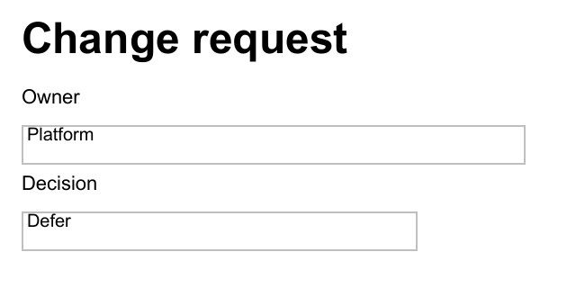

When someone asks me to "automate a PDF," I first ask what they mean. Are we creating a report from data, or changing a PDF that already exists? Both end with a `.pdf` file, but the scripts should look very different.

PSWriteOffice supports both jobs through the OfficeIMO PDF engine. For a new report, I use the composition DSL for headings, paragraphs, rich text, tables, lists, images, forms, headers, footers, bookmarks, and attachments. For an existing file, I reach for focused commands that inspect, extract, merge, split, reorder, stamp, overlay, redact, sanitize, or optimize it.

Keeping those paths separate makes the script easier to understand. A paragraph should flow onto the next page without coordinates. A review stamp should land at the exact coordinates I give it.

## Before you start

Use PowerShell 7 and install the current public modules used for this article:

```powershell
Install-Module PSWriteOffice -Scope CurrentUser -Force
Import-Module PSWriteOffice
```

Run the examples from a folder where you can write the generated files. Replace the sample files and service details with your own after the first successful run.

## Compose a report in document flow

If my script owns the report, I start with the DSL and let the page layout engine place the content. The report can grow without turning every page break into another calculation.

```powershell
$findings = @(
    [pscustomobject]@{ Severity = 'High'; Finding = 'Dormant administrator account'; Owner = 'Identity' }
    [pscustomobject]@{ Severity = 'Medium'; Finding = 'Missing evidence link'; Owner = 'Operations' }
)

PdfNew -Path '.\Access-Review.pdf' {
    PdfTheme Report
    PdfHeading 'Access review'
    PdfParagraph 'Prepared for the weekly security review.'
    PdfTable -InputObject $findings
    PdfText 'Review status: Draft' -Italic -Color '#B45309'
}
```

I use the short PDF aliases throughout this block. The longer equivalents are `New-OfficePdf`, `Set-OfficePdfTheme`, `Add-OfficePdfHeading`, `Add-OfficePdfParagraph`, `Add-OfficePdfTable`, and `Add-OfficePdfText`. Both styles call the same engine; mixing them in one report just makes the script harder to scan.

The constructor does not write an object to the pipeline after saving, so `Out-Null` is unnecessary. Add `-PassThru` only when the next command needs the saved file.

## Format one line without building paragraphs by hand

For mixed formatting on one line, I use a text run. The columnar form is especially readable when the values come from an object:

```powershell
$finding = [pscustomobject]@{
    Owner = 'Identity'
    Due = '2026-08-28'
    Severity = 'High'
}

PdfNew -Path '.\Finding-Summary.pdf' {
    PdfHeading 'Finding summary'
    PdfText -Run @{
        Text  = 'Owner: ', $finding.Owner, '    Due: ', $finding.Due, '    Severity: ', $finding.Severity
        Bold  = $true, $false, $true, $false, $true, $false
        Color = $null, $null, $null, $null, $null, 'Crimson'
    }
}
```

A single style value applies to every segment. If you pass a style array, it must contain either one value or the same number of entries as `Text`. A missing entry cannot silently move bold or color onto the wrong value.

## Position text at exact coordinates

`PdfText` and `PdfParagraph` belong to normal document flow, so they do not have `X` and `Y` parameters. When I need a page label, signature, or another item at a fixed point, I add canvas content to an existing PDF:

```powershell
Add-OfficePdfCanvas -Path '.\Access-Review.pdf' -OutputPath '.\Access-Review-Positioned.pdf' -Content {
    PdfCanvasText -Run @(
        TextRun 'Owner: ' -Bold
        TextRun 'Platform' -Color '#0F766E'
        TextRun '  |  REVIEW COPY' -Italic
    ) -X 36 -Y 24 -FontSize 10
}
```

Canvas coordinates use PDF points measured from the visual top-left of the page. The canvas fits page labels, registration marks, fixed headers, signatures, and generated overlays. For one text or image mark, `Add-OfficePdfStamp` is shorter. To place a complete imported page over another page, use `Add-OfficePdfPageOverlay`.

The canvas command accepts normal strings and rich text runs directly. You do not need to construct a runtime-typed .NET array in PowerShell.

## Add forms and exchange their data

Form fields can be part of the original composition:

```powershell
PdfNew -Path '.\Change-Request.pdf' {
    PdfHeading 'Change request'
    PdfText 'Owner'
    PdfFormField -Name Owner -Type Text -Value 'Platform' -Width 280
    PdfText 'Decision'
    PdfFormField -Name Decision -Type Choice -Options Approve,Reject,Defer -Value Defer -Width 220
}
```



When another system needs to exchange or archive the field values separately, I use XFDF:

```powershell
Export-OfficePdfXfdf -Path '.\Change-Request.pdf' -OutputPath '.\Change-Request.xfdf'
Import-OfficePdfXfdf -Path '.\Change-Request.pdf' -XfdfPath '.\Change-Request.xfdf' -OutputPath '.\Change-Request-Updated.pdf'
```

PSWriteOffice can inspect fields, work with annotations, and flatten the form. I flatten only the delivery copy, after nobody needs to edit the fields again.

## Attach evidence to the delivery copy

Sometimes the evidence belongs with the report but should not become another visible page. In that case I attach it:

```powershell
PdfNew -Path '.\Audit-Report.pdf' {
    PdfTheme Report
    PdfHeading 'Audit report'
    PdfParagraph 'The supporting evidence is embedded in this PDF.'
    PdfAttachment `
        -Path '.\Evidence-Summary.pdf' `
        -Name 'evidence-summary.pdf' `
        -MimeType 'application/pdf' `
        -Relationship Data `
        -Description 'Supporting review evidence'
}
```

This works well for evidence packs, electronic invoices, source data, or signed supporting documents. The attachment remains a separate file inside the PDF.

## Reorder, merge, and split existing pages

Page operations do not require rebuilding the document. This example moves the approval page to the front and writes a new file:

```powershell
Move-OfficePdfPage `
    -Path '.\Review-Pack.pdf' `
    -PageRange '3' `
    -BeforePage 1 `
    -OutputPath '.\Review-Pack-Reordered.pdf'
```

`Join-OfficePdf` assembles a pack, while `Split-OfficePdf` separates it by page range or number of pages per document. I keep the source file until the result has been checked. Successfully writing a PDF does not prove that every advanced feature in the original survived the transformation.

## Export an Office document to PDF deliberately

For Word, Excel, PowerPoint, Markdown, and RTF, I create the source artifact first and request PDF as a separate delivery step. That keeps a failed conversion from being hidden inside a `New-*` or `Save-*` command:

```powershell
New-OfficeWord -Path '.\Service-Review.docx' {
    WordParagraph -Text 'Service review' -Style Heading1
    WordParagraph 'This editable report is the source artifact.'
    WordTable -InputObject $findings -Layout AutoFitToWindow
}

Export-OfficeDocumentPdf `
    -InputPath '.\Service-Review.docx' `
    -Path '.\Service-Review.pdf'
```

This command deliberately uses `InputPath` for the source because `Path` names the PDF being produced. Elsewhere, commands use `Path` for the primary file, `OutputPath` for a transformed copy, and `DestinationPath` for a copy destination.

## Extract and inspect before changing

Before I change an unfamiliar PDF, I inspect it. The read-only commands also make the same files useful in search, compliance, and ingestion workflows:

```powershell
$pages = Get-OfficePdfText -Path '.\Policy.pdf' -ByPage
$pages | Select-Object PageNumber, Text
```

There are commands for document information, fonts, images, attachments, form fields, annotations, signatures, compliance, interactions, optimization opportunities, and rewrite safety. I use that evidence before redaction, sanitization, optimization, or destructive page changes.

For sensitive content, build a redaction plan from detected text and write a new delivery copy. Drawing a black rectangle is not redaction; the underlying text may still be present. `ConvertTo-OfficePdfRedacted` removes it through the PDF engine.

## Deliver the result with Mailozaurr

After the PDF has been reviewed, Mailozaurr can send the delivery copy:

```powershell
$mailCredential = Get-Secret -Name 'Reporting-Smtp-Credential'

Send-EmailMessage `
    -From 'reports@example.com' `
    -To 'reviewers@example.com' `
    -Subject 'Access review' `
    -Text 'The editable source and PDF delivery copy are attached.' `
    -Attachment '.\Service-Review.docx', '.\Service-Review.pdf' `
    -Server 'smtp.example.com' `
    -Credential $mailCredential `
    -UseSsl
```

PSWriteOffice creates the files; Mailozaurr handles the message, authentication, transport, and mailbox operations. The report code stays the same whether delivery uses SMTP, Microsoft Graph, Gmail, SendGrid, Mailgun, or Amazon SES.

`Get-Secret` comes from Microsoft.PowerShell.SecretManagement. Store the credential in the secret provider trusted by the scheduled job or CI runner, rather than in the report script.

## Which command should I use?

| Job | Surface |
| --- | --- |
| New report with flowing content | PDF DSL |
| Mixed formatting inside a line | `PdfText -Run` |
| Exact page coordinates | Canvas or stamp |
| Embed supporting files | Attachment DSL |
| Interactive input | Form fields and XFDF |
| Combine or rearrange supplied PDFs | Join, split, move, copy, or remove page commands |
| Search or compliance evidence | Text extraction, inspection, diagnostics, and preflight |
| Safe delivery copy | Redaction, sanitization, optimization, flattening, or signing commands |

The [PSWriteOffice PDF recipes](https://github.com/EvotecIT/PSWriteOffice/tree/main/Examples/Pdf) contain complete scripts for invoices, audit reports, forms, attachments, extraction, page reordering, merging, splitting, positioned content, redaction, sanitization, and preflight. They use simple local file names so you can run one first and replace the sample data afterward.

My rule is simple: compose new reports in document flow, use coordinates only for content that really has a fixed position, and use a focused command when changing an existing PDF. That keeps a large PDF workflow readable even after forms, evidence, delivery, and compliance checks are added.
