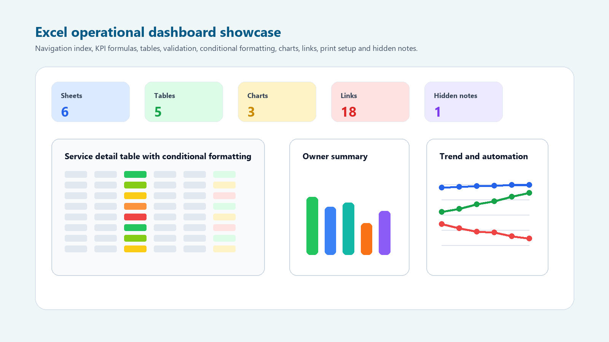
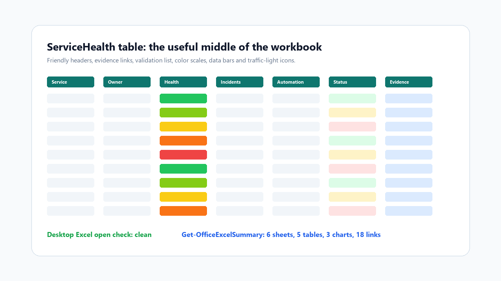
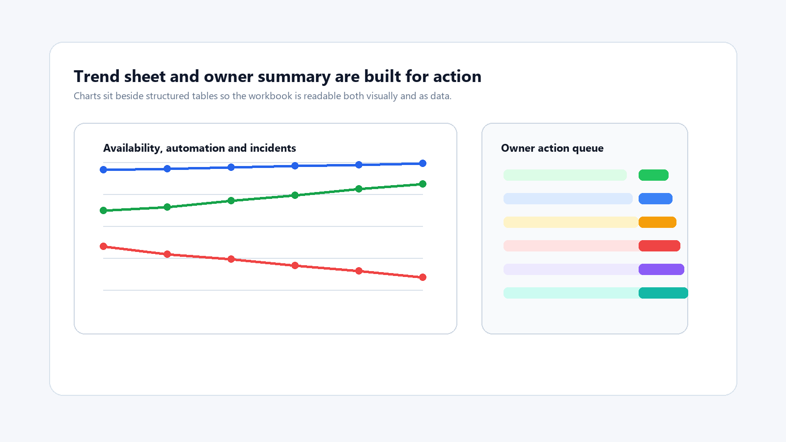

Good Excel automation is not about pushing two rows into a workbook. A useful workbook gives readers a starting point, a way to drill into details, and enough formatting to find risk quickly without losing the underlying data.

This showcase builds a multi-sheet operational dashboard from PowerShell objects. It creates a summary page, service detail table, trend sheet, owner summary, hidden notes sheet, generated table of contents, internal backlinks, evidence hyperlinks, formulas, validation, conditional formatting, charts, page setup, headers, footers, and a structural summary check.



## Workbook Shape

The full script lives in `Examples/Showcase/Showcase-Excel-OperationalDashboard.ps1` in the PSWriteOffice repository.

It produces a workbook with these sheets:

- `Index`: generated table of contents with links and backlinks
- `Summary`: KPI formulas and a status legend chart
- `Services`: the main operational table
- `Trend`: month-by-month availability, incident, and automation data
- `Owner Summary`: grouped ownership view for follow-up
- `Notes`: hidden generation notes for audit/debugging

That shape matters because people rarely consume Excel reports in one direction. Some readers start with the summary, some filter the detail table, and some want to jump straight to ownership or trend data.

## Building The Summary Sheet

The summary sheet combines formulas, a styled table, chart formatting, freeze panes, and print defaults.

```powershell
New-OfficeExcel -Path $path {
    ExcelSheet 'Summary' {
        ExcelCell -Address 'A1' -Value 'Operational Dashboard' -Bold -FontSize 20
        ExcelCell -Address 'B4' -Formula 'AVERAGE(Services!C2:C9)' -NumberFormat '0.0'
        ExcelCell -Address 'B5' -Formula 'SUM(Services!D2:D9)'
        ExcelCell -Address 'B6' -Formula 'AVERAGE(Trend!D2:D7)' -NumberFormat '0%'

        ExcelTable -Data $legend `
            -TableName 'StatusLegend' `
            -StartRow 7 `
            -StartColumn 1 `
            -TableStyle 'TableStyleMedium4' `
            -AutoFit

        ExcelChart -Range 'A7:B10' `
            -Row 7 `
            -Column 6 `
            -Type Doughnut `
            -Title 'Status Meaning Mix' |
            Set-OfficeExcelChartLegend -Position Right |
            Set-OfficeExcelChartDataLabels -ShowValue $true -ShowCategoryName $true |
            Set-OfficeExcelChartStyle -StyleId 251 -ColorStyleId 10
    }
}
```

The output remains a normal `.xlsx`: formulas are formulas, tables are tables, charts are charts, and people can keep editing in desktop Excel.

## Detail Sheet: Where The Work Happens

The `Services` sheet is designed for action. It uses a structured table, validation list, color scale, data bars, traffic-light icons, and evidence links generated from a header.



```powershell
ExcelSheet 'Services' {
    ExcelTable -Data $services `
        -TableName 'ServiceHealth' `
        -StartRow 1 `
        -StartColumn 1 `
        -TableStyle 'TableStyleMedium9' `
        -AutoFit

    ExcelFreeze -TopRows 1
    ExcelValidationList -Range 'F2:F50' -Values 'Healthy','Watch','Risk'
    ExcelConditionalColorScale -Range 'C2:C9' -StartColor '#F8696B' -EndColor '#63BE7B'
    ExcelConditionalDataBar -Range 'D2:D9' -Color '#5B9BD5'
    ExcelConditionalIconSet -Range 'C2:C9' -IconSet ThreeTrafficLights1 -Reverse $true

    ExcelUrlLinksByHeader `
        -Header 'Evidence' `
        -TableName 'ServiceHealth' `
        -UrlScript { param($text) "https://evotec.xyz/docs/$text" } `
        -TitleScript { param($text) "Open $text" }
}
```

This is the sweet spot for PowerShell-generated Excel: repeatable input data, but still a workbook that feels native when opened by a human.

## Trend And Ownership

The dashboard also includes trend and owner-summary sheets so the report can answer both "what changed?" and "who needs to act?"



```powershell
ExcelSheet 'Trend' {
    ExcelTable -Data $trend -TableName 'TrendData' -TableStyle 'TableStyleMedium2' -AutoFit

    ExcelChart -TableName 'TrendData' `
        -Row 10 `
        -Column 1 `
        -Type Line `
        -Title 'Availability, Incidents, and Automation' |
        Set-OfficeExcelChartLegend -Position Bottom |
        Set-OfficeExcelChartDataLabels -ShowValue $true -Position Top |
        Set-OfficeExcelChartStyle -StyleId 251 -ColorStyleId 10
}
```

The owner summary is intentionally table-based while PivotTable desktop-open compatibility is being repaired. That is an important showcase rule: a flagship example should open cleanly before it tries to show every possible feature.

## Navigation And Hidden Notes

After the sheets are created, PSWriteOffice can generate workbook navigation automatically.

```powershell
ExcelTableOfContents `
    -SheetName 'Index' `
    -IncludeNamedRanges `
    -AddBackLinks `
    -BackLinkText 'Back to Index'
```

The hidden `Notes` sheet keeps generation details inside the workbook without cluttering the visible report.

```powershell
ExcelSheet 'Notes' {
    ExcelCell -Address 'A1' -Value 'Generation Notes'
    ExcelCell -Address 'A2' -Value 'This sheet is hidden and carries audit/debugging inputs.'
    ExcelCell -Address 'A5' -Value 'Source'
    ExcelCell -Address 'B5' -Value 'Examples/Showcase/Showcase-Excel-OperationalDashboard.ps1'
    ExcelSheetVisibility -Hide
}
```

## Proving The Workbook Shape

The showcase also adds `Get-OfficeExcelSummary`, which is the practical "what did we actually generate?" command.

```powershell
$summary = Get-OfficeExcelSummary -Path $path -IncludeSheets

$summary | Select-Object `
    SheetCount,
    TableCount,
    ChartCount,
    HyperlinkCount,
    HiddenSheetCount

$summary.Sheets |
    Select-Object Name, State, UsedRange, TableCount, ChartCount
```

For the generated dashboard, the summary reports:

- 6 sheets
- 5 tables
- 3 charts
- 18 links
- 1 hidden sheet

That makes the example useful in demos and CI logs. It also gives you a fast way to explain what a workbook contains without opening Excel.

## Honest Compatibility Notes

This showcase intentionally avoids PivotTables and sparklines for now. The cmdlets exist, but generated packages still need an OfficeIMO desktop-open compatibility pass before they should appear in a flagship workbook.

The current dashboard focuses on a clean, useful, visually attractive workbook that validates and opens in desktop Excel.
