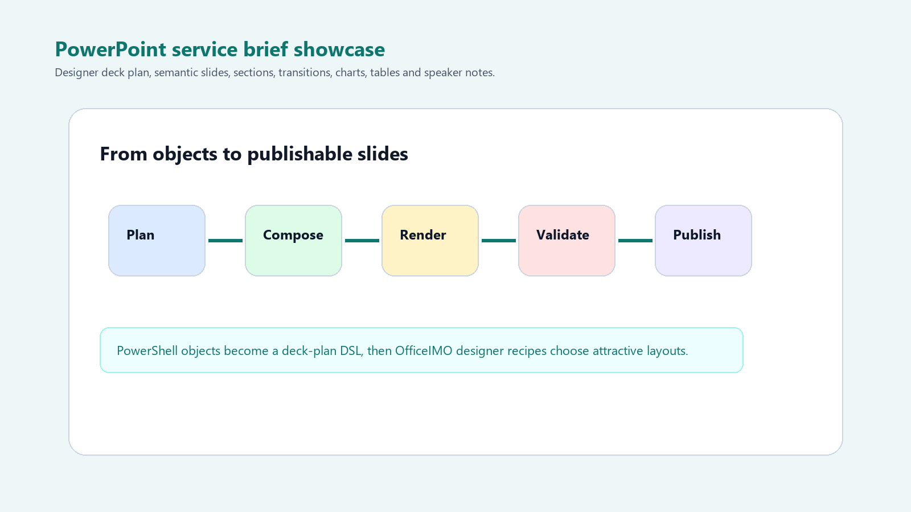
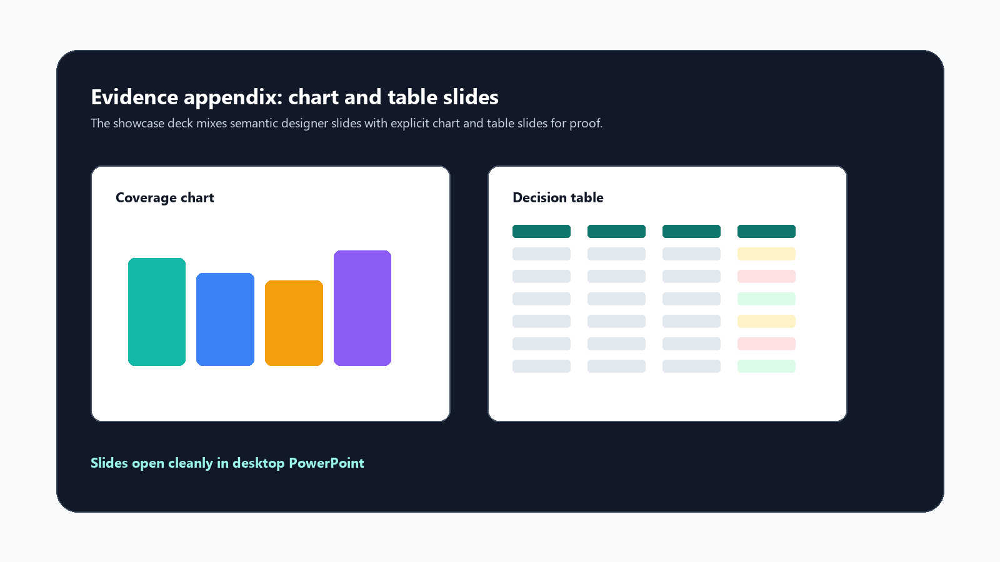

PowerPoint automation gets painful when every slide is a coordinate exercise. You can create slides that way, but it does not scale into attractive decks unless you build a lot of layout knowledge yourself.

The newer OfficeIMO PowerPoint designer APIs move the problem up a level: describe the deck semantically, then let the engine choose layouts and render a complete editable `.pptx`. PSWriteOffice now exposes an initial bridge to that designer layer, so PowerShell can build decks from objects without turning every script into a design math project.



## What The Example Builds

The full script lives in `Examples/Showcase/Showcase-PowerPoint-ServiceBrief.ps1` in the PSWriteOffice repository.

It creates a service brief deck with:

- 16:9 slide size
- branded accent color
- OfficeIMO designer deck-plan rendering
- section slide
- process slide
- card-grid slide
- coverage/map-like slide
- capability slide
- case-study slide
- explicit chart slide
- explicit table slide
- speaker notes
- named sections
- slide transitions
- desktop PowerPoint open validation

The point is not only "PowerShell can add a slide." The point is that PowerShell can generate an editable consulting/service deck that is good enough to use as a real starting point.

## Deck Plan First

The example begins with business-shaped PowerShell objects: process steps, product cards, coverage areas, capabilities, and metrics.

```powershell
$process = @(
    [pscustomobject]@{
        Title = 'Compare'
        Description = 'Map PSWriteOffice against OfficeIMO capabilities.'
        AccentColor = '#008C95'
    }
    [pscustomobject]@{
        Title = 'Compose'
        Description = 'Create showcase scripts that generate real artifacts.'
        AccentColor = '#3B82F6'
    }
    [pscustomobject]@{
        Title = 'Publish'
        Description = 'Use screenshots, code, and blogs to explain the output.'
        AccentColor = '#F59E0B'
    }
)
```

Those objects become a semantic deck plan:

```powershell
$plan = PptDeckPlan {
    PptPlanSection `
        -Title 'PSWriteOffice Showcase' `
        -Subtitle 'Beautiful, useful Office artifacts from PowerShell' `
        -Seed 'showcase-cover'

    PptPlanProcess `
        -Title 'From objects to publishable artifacts' `
        -Subtitle 'A repeatable path for examples and blog posts' `
        -Steps $process `
        -Seed 'delivery-process'

    PptPlanCardGrid `
        -Title 'Product surfaces' `
        -Subtitle 'Each product should show a real workflow, not only primitives.' `
        -Cards $cards `
        -Seed 'product-cards'

    PptPlanCoverage `
        -Title 'Where the work belongs' `
        -Subtitle 'Engine, wrapper, examples, and website stay distinct.' `
        -Locations $coverage `
        -Seed 'coverage-map'

    PptPlanCapability `
        -Title 'Quality bar' `
        -Subtitle 'The showcase should be practical enough to copy and attractive enough to publish.' `
        -Sections $capabilities `
        -Seed 'quality-bar'
}
```

This is the important shift: the script describes intent. The designer layer handles visual composition.

## Rendering Through The Designer Bridge

The deck is rendered with `PptDesignerDeck`, which maps the PSWriteOffice plan into OfficeIMO's designer/deck-plan model.

```powershell
New-OfficePowerPoint -Path $path {
    PptSlideSize -Preset Screen16x9

    PptDesignerDeck `
        -Plan $plan `
        -AccentColor '#008C95' `
        -Seed 'pswriteoffice-showcase' `
        -Purpose 'technical service brief' `
        -Name 'PSWriteOffice Showcase' `
        -FooterLeft 'PSWriteOffice' `
        -FooterRight 'OfficeIMO designer' `
        -CreativeDirectionPack TechnicalMap `
        -LayoutStrategy ContentFirst
}
```

The generated deck remains editable in PowerPoint. These are normal slides, shapes, notes, charts, and tables.

## Adding Explicit Evidence Slides

A deck-plan layer is excellent for narrative slides, but a service brief also needs evidence. The showcase adds explicit chart and table slides after the designer-rendered deck.



```powershell
$chartSlide = PptSlide -Title 'Showcase coverage by product'

PptChart `
    -Slide $chartSlide `
    -Data $coverageRows `
    -CategoryProperty Product `
    -SeriesProperty Coverage `
    -Type ColumnClustered `
    -Title 'Coverage by product' `
    -X 60 `
    -Y 130 `
    -Width 520 `
    -Height 310

PptNotes -Slide $chartSlide -Text 'Use this slide to explain current coverage and known follow-up areas.'
```

The table slide uses the same principle: let objects carry the data, let PSWriteOffice create the Office artifact.

```powershell
$tableSlide = PptSlide -Title 'Implementation checklist'

PptTable `
    -Slide $tableSlide `
    -Data $checklist `
    -X 55 `
    -Y 120 `
    -Width 820 `
    -Height 300

PptNotes -Slide $tableSlide -Text 'Keep this slide as the handoff checklist for the next polish pass.'
```

## Sections And Transitions

The example also adds deck polish that matters when the file is opened by a person.

```powershell
Add-OfficePowerPointSection `
    -Presentation $ppt `
    -Name 'Designer story' `
    -StartSlideIndex 0

Add-OfficePowerPointSection `
    -Presentation $ppt `
    -Name 'Evidence appendix' `
    -StartSlideIndex 6

Get-OfficePowerPointSlide -Presentation $ppt -Index 0 |
    Set-OfficePowerPointSlideTransition -Transition Fade

Get-OfficePowerPointSlide -Presentation $ppt -Index 6 |
    Set-OfficePowerPointSlideTransition -Transition PushLeft
```

The output is not a static export. It is a deck you can continue editing, presenting, importing into another deck, or using as a template for future automation.

## What This Enables

This is a first bridge, not the end of the PowerPoint story. It already demonstrates:

- fewer coordinates in PowerShell scripts
- repeatable slide composition
- semantic deck planning
- designer-generated visual structure
- mixed semantic and explicit evidence slides
- speaker notes and maintenance metadata

The next useful polish is richer diagnostics, metrics and visual-frame helpers, and shape-layout commands for manual refinement. But even this first pass changes the ergonomics: PowerShell can now express the story of a deck, not just place shapes on a canvas.
