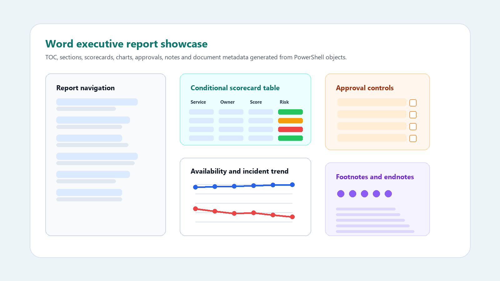

Word automation is easy when the target is a plain export. It becomes much more useful when the output is something a manager, auditor, or service owner can open, navigate, review, and approve without asking for the original script.

This showcase builds a complete executive service-health report from PowerShell objects. The generated document is not a screenshot or a blob: it is an editable `.docx` with real sections, headings, tables, charts, bookmarks, hyperlinks, content controls, footnotes, endnotes, metadata, and a watermark.



## What The Example Builds

The full script lives in `Examples/Showcase/Showcase-Word-ExecutiveReport.ps1` in the PSWriteOffice repository. It creates a report with:

- a strong opening section with a generated banner image
- header and footer content
- built-in and custom document properties
- a Word table of contents
- multiple heading levels
- a conditional service scorecard table
- a line chart for availability and incident trends
- a recommended-actions table
- bookmark and hyperlink navigation
- approval content controls
- watermarking
- one footnote and one endnote
- a read-back summary proving the document shape after generation

The input is ordinary PowerShell data. That is the point: the report is built from objects you already have in monitoring, inventory, compliance, or service-management scripts.

```powershell
$services = @(
    [pscustomobject]@{
        Service = 'Identity Platform'
        Owner = 'IAM'
        Health = 96
        Incidents = 1
        Status = 'Healthy'
        NextAction = 'Keep weekly drift review'
    }
    [pscustomobject]@{
        Service = 'Certificate Lifecycle'
        Owner = 'Security'
        Health = 74
        Incidents = 4
        Status = 'Watch'
        NextAction = 'Finish renewal automation rollout'
    }
)
```

## Composing The Document

The Word DSL keeps the script close to how people think about reports: sections, headings, paragraphs, tables, charts, and review controls.

```powershell
New-OfficeWord -Path $path {
    WordSection {
        WordHeader {
            WordParagraph {
                WordBold 'PSWriteOffice Showcase'
                WordText ' | Executive service health'
            }
        }

        Set-OfficeWordDocumentProperty -Name Title -Value 'Executive Service Health Report'
        Set-OfficeWordDocumentProperty -Name ShowcaseProduct -Value 'Word' -Custom

        WordParagraph -Text 'Executive Service Health Report' -Style Heading1
        WordImage -Path $heroPath -Width 640 -Height 147

        WordParagraph {
            WordText 'This report turns service-health objects into an editable Word document.'
            WordFootnote 'The sample uses synthetic data generated entirely in PowerShell.'
        }

        WordBookmark -Name 'ExecutiveSummary'
        WordTableOfContent -Style Template1
    }
}
```

The generated file remains a normal Word document. You can update the table of contents, edit text, accept approvals, copy tables, or reuse the chart in another document.

## Making Tables Useful

The scorecard is more than an object dump. Rows are formatted based on status, so readers can scan the document before reading every line.

```powershell
WordParagraph -Text 'Service Scorecard' -Style Heading1

WordTable -InputObject $services -Style GridTable4Accent1 -Layout AutoFitToWindow {
    WordTableCondition -FilterScript { $_.Status -eq 'Needs action' } -BackgroundColor '#fde2e2'
    WordTableCondition -FilterScript { $_.Status -eq 'Watch' } -BackgroundColor '#fff4cc'
    WordTableCondition -FilterScript { $_.Status -eq 'Healthy' } -BackgroundColor '#e2f7e1'
}
```

That is the difference between "we exported data" and "we created something someone can use in a review meeting."

## Charts, Notes, And Approvals

The showcase also demonstrates a Word line chart, approval controls, reviewer notes, and internal navigation.

```powershell
WordChart -Type Line `
    -Data $trend `
    -CategoryProperty Month `
    -SeriesProperty Availability, Incidents `
    -Title 'Availability and incident trend' `
    -Legend `
    -LegendPosition Bottom `
    -XAxisTitle 'Month' `
    -YAxisTitle 'Value' `
    -FitToPageWidth

WordParagraph {
    WordHyperlink -Text 'Jump back to Executive Summary' -Anchor 'ExecutiveSummary' -Styled
}

WordParagraph {
    WordText 'Risk labels combine incidents, owner feedback, and observed trend.'
    WordEndnote 'The scoring model is intentionally simple for the showcase.'
}
```

Approval fields are created as Word content controls, so the output is still easy to finish manually:

```powershell
WordParagraph { WordContentControl -Text 'Executive sponsor' -Alias 'SponsorName' }
WordParagraph { WordDatePicker -Date (Get-Date) -Alias 'ApprovalDate' }
WordParagraph { WordCheckBox -Alias 'ApprovedForDistribution' }
```

## Read-Back Proof

The example finishes by reopening the document and reporting what was created. This is useful for tests, demos, and CI logs.

```powershell
$document = Get-OfficeWord -Path $path -ReadOnly
try {
    [pscustomobject]@{
        Paragraphs      = $document.Paragraphs.Count
        Tables          = $document.Tables.Count
        Charts          = $document.Charts.Count
        ContentControls = $document.StructuredDocumentTags.Count
        Footnotes       = @(Get-OfficeWordFootnote -Document $document).Count
        Endnotes        = @(Get-OfficeWordEndnote -Document $document).Count
    }
}
finally {
    Close-OfficeWord -Document $document
}
```

## Why This Is A Product Showcase

This example exercises the things that make Word automation valuable in real projects: navigation, editable structure, review controls, metadata, evidence notes, and formatting that helps readers decide what matters.

`OfficeIMO.Word` provides the Open XML engine. `PSWriteOffice` makes the authoring layer feel like PowerShell: pass objects in, compose a report, save a real Office document, and verify the output.
