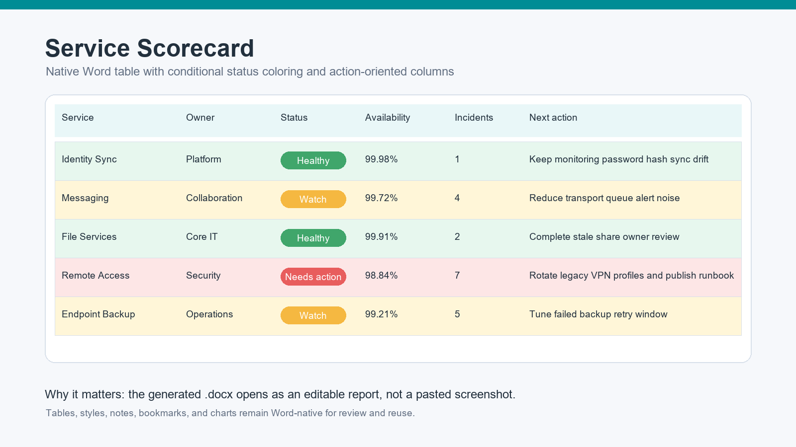
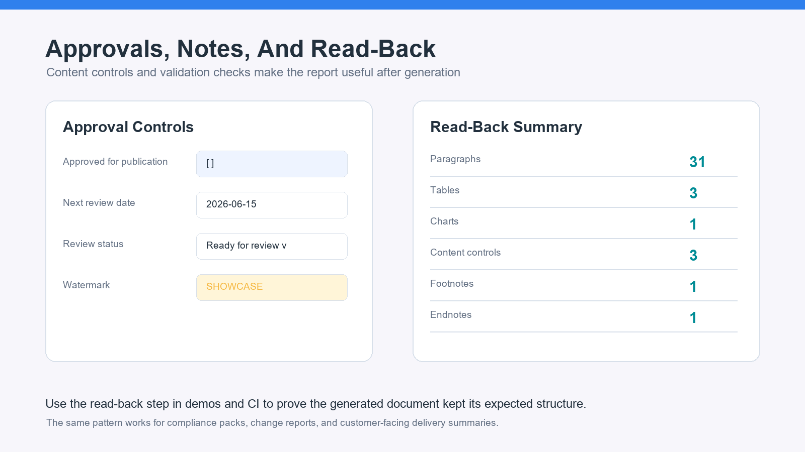

Word automation is easy when the target is a plain export. It becomes much more useful when the output is something a manager, auditor, or service owner can open, navigate, review, approve, and reuse without asking for the original script.

This showcase builds a complete executive service-health report from PowerShell objects. It uses the same operational story as the Excel dashboard and PowerPoint brief in this series: services, owners, health signals, incidents, trends, and next actions. The generated document is not a screenshot or a blob. It is an editable `.docx` with real sections, headings, tables, charts, bookmarks, hyperlinks, content controls, footnotes, endnotes, metadata, and a watermark.


## What The Example Builds

The full script lives in `Examples/Showcase/Showcase-Word-ExecutiveReport.ps1` in the PSWriteOffice repository. It creates a report with:

- a native opening panel built from Word paragraphs and tables
- header and footer content
- built-in and custom document properties
- a Word table of contents
- multiple heading levels
- a conditional service scorecard table
- a line chart for availability and incident trends
- a recommended-actions table
- bookmark and hyperlink navigation
- approval content controls
- watermarking
- one footnote and one endnote
- a read-back summary proving the document shape after generation

The input is ordinary PowerShell data. That is the point: the report is built from objects you already have in monitoring, inventory, compliance, or service-management scripts.

```powershell
$services = @(
    [pscustomobject]@{
        Service = 'Identity Platform'
        Owner = 'IAM'
        Health = 96
        Incidents = 1
        Status = 'Healthy'
        NextAction = 'Keep weekly drift review'
    }
    [pscustomobject]@{
        Service = 'Certificate Lifecycle'
        Owner = 'Security'
        Health = 74
        Incidents = 4
        Status = 'Watch'
        NextAction = 'Finish renewal automation rollout'
    }
)
```

## Writing The Document

The Word DSL keeps the script close to how people think about reports: sections, headings, paragraphs, tables, charts, and review controls. The first page is intentionally Office-native. It does not depend on `System.Drawing`, desktop Word, or a pre-rendered bitmap.

```powershell
$executiveSignals = @(
    [pscustomobject]@{
        Signal = 'Audience'
        Detail = 'Technology leadership, service owners, and operational reviewers'
    }
    [pscustomobject]@{
        Signal = 'Decision'
        Detail = 'Approve the focused remediation plan for high-friction services'
    }
)

New-OfficeWord -Path $path {
    WordSection {
        WordHeader {
            WordParagraph {
                WordBold 'PSWriteOffice Showcase'
                WordText ' | Executive service health'
            }
        }

        Set-OfficeWordDocumentProperty -Name Title -Value 'Executive Service Health Report'
        Set-OfficeWordDocumentProperty -Name ShowcaseProduct -Value 'Word' -Custom

        WordParagraph -Text 'Executive Service Health Report' -Style Heading1
        WordParagraph 'Generated from PowerShell objects with PSWriteOffice and OfficeIMO.'
        WordTable -InputObject $executiveSignals -Style GridTable5DarkAccent1 -Layout AutoFitToWindow

        WordParagraph {
            WordText 'This report turns service-health objects into an editable Word document.'
            WordFootnote 'The sample uses synthetic data generated entirely in PowerShell.'
        }

        WordBookmark -Name 'ExecutiveSummary'
        WordTableOfContent -Style Template1
    }
}
```

The generated file remains a normal Word document. You can update the table of contents, edit text, accept approvals, copy tables, or reuse the chart in another document.

## Making Tables Useful

The scorecard is more than an object dump. Rows are formatted based on status, so readers can scan the document before reading every line.

```powershell
WordParagraph -Text 'Service Scorecard' -Style Heading1

WordTable -InputObject $services -Style GridTable4Accent1 -Layout AutoFitToWindow {
    WordTableCondition -FilterScript { $_.Status -eq 'Needs action' } -BackgroundColor '#fde2e2'
    WordTableCondition -FilterScript { $_.Status -eq 'Watch' } -BackgroundColor '#fff4cc'
    WordTableCondition -FilterScript { $_.Status -eq 'Healthy' } -BackgroundColor '#e2f7e1'
}
```

That is the difference between "we exported data" and "we created something someone can use in a review meeting."



## Charts, Notes, And Approvals

The showcase also demonstrates a Word line chart, approval controls, reviewer notes, and internal navigation.

```powershell
WordChart -Type Line `
    -Data $trend `
    -CategoryProperty Month `
    -SeriesProperty Availability, Incidents `
    -Title 'Availability and incident trend' `
    -Legend `
    -LegendPosition Bottom `
    -XAxisTitle 'Month' `
    -YAxisTitle 'Value' `
    -FitToPageWidth

WordParagraph {
    WordHyperlink -Text 'Jump back to Executive Summary' -Anchor 'ExecutiveSummary' -Styled
}

WordParagraph {
    WordText 'Risk labels combine incidents, owner feedback, and observed trend.'
    WordEndnote 'The scoring model is intentionally simple for the showcase.'
}
```

Approval fields are created as Word content controls, so the output is still easy to finish manually:

```powershell
WordParagraph {
    WordText 'Approved for publication: '
    WordCheckBox -Alias 'ApprovedForPublication' -Tag 'approval-publish'
}
WordParagraph {
    WordText 'Next review date: '
    WordDatePicker -Date (Get-Date '2026-06-15') -Alias 'NextReviewDate'
}
WordParagraph {
    WordText 'Review status: '
    WordDropDownList -Items 'Draft','Ready for review','Approved' -Alias 'ReviewStatus'
}
```



## Reading And Validating The Output

The example finishes by reopening the document and reporting what was created. This is useful for tests, demos, and CI logs.

```powershell
$document = Get-OfficeWord -Path $path -ReadOnly
try {
    [pscustomobject]@{
        Paragraphs      = $document.Paragraphs.Count
        Tables          = $document.Tables.Count
        Charts          = $document.Charts.Count
        ContentControls = $document.StructuredDocumentTags.Count
        Footnotes       = @(Get-OfficeWordFootnote -Document $document).Count
        Endnotes        = @(Get-OfficeWordEndnote -Document $document).Count
    }
}
finally {
    Close-OfficeWord -Document $document
}
```

That read-back step is more than a demo flourish. It lets you fail a build if the report accidentally loses its chart, content controls, or reviewer notes.

```powershell
if ($document.Charts.Count -lt 1) {
    throw 'Expected at least one chart in the executive report.'
}

if ($document.Tables.Count -lt 3) {
    throw 'Expected opening, scorecard, and action-plan tables.'
}
```

## Performance And Scale

The fastest Word automation is not usually about micro-optimizing a paragraph. It is about using the right shape:

- Build data as PowerShell objects first, then pass arrays into `WordTable` and `WordChart`.
- Keep expensive read-back validation focused on structure, counts, and key fields.
- Use tables and styles instead of thousands of individually formatted runs.
- Generate without Microsoft Word installed, which keeps CI and server usage realistic.
- Save once at the end of the composition block instead of opening and closing the file repeatedly.

For large reports, split the document into predictable sections: summary, findings, evidence, action plan, and appendix. That keeps generation fast and keeps the final document easy to review.

## More Report Ideas

The same pattern works for more than service health:

- Compliance attestation with owner sign-off controls.
- Change advisory reports with risk tables, bookmarks, and approval date pickers.
- Active Directory or Microsoft 365 assessments with findings, evidence links, and remediation tables.
- Monthly operations packs with trend charts, generated TOC, and hidden reviewer notes.
- Customer-facing delivery reports where metadata and internal navigation matter.

## Why This Is A Product Showcase

This example exercises the things that make Word automation valuable in real projects: navigation, editable structure, review controls, metadata, evidence notes, and formatting that helps readers decide what matters.

`OfficeIMO.Word` provides the Open XML engine. `PSWriteOffice` makes the authoring layer feel like PowerShell: pass objects in, compose a report, save a real Office document, and verify the output.
