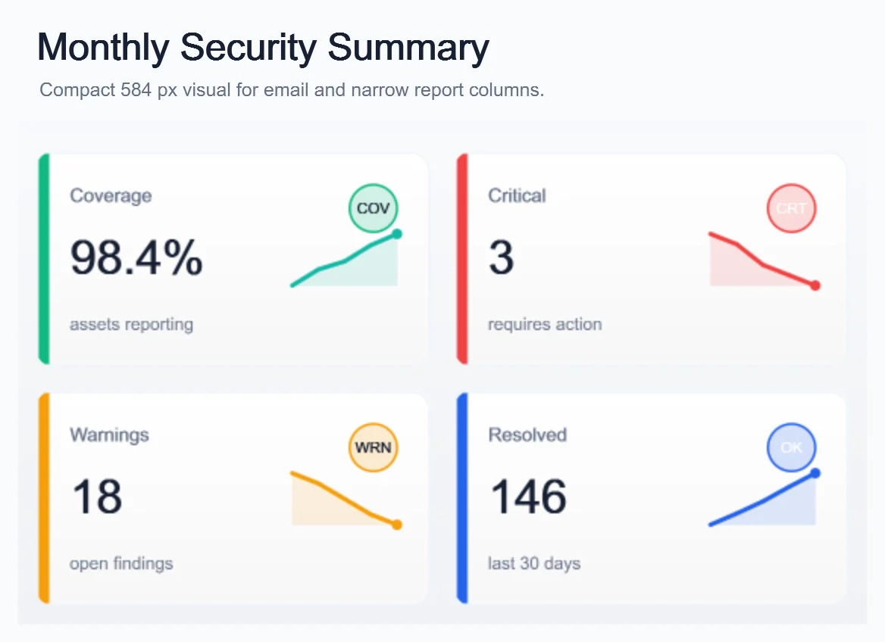
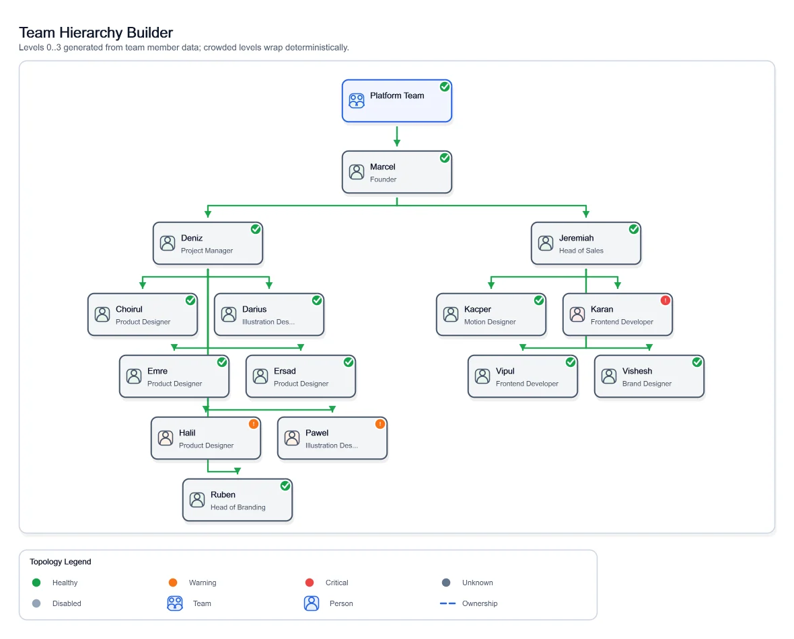
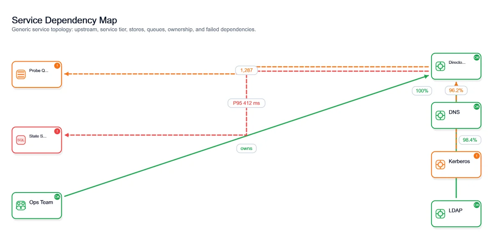

Many chart libraries begin with a browser. That is a good fit for an interactive dashboard, but it becomes awkward when the real destination is an email, a PDF pipeline, a generated report, a desktop background, build documentation, or a static site.

[ChartForgeX](https://github.com/EvotecIT/ChartForgeX) starts from a different requirement: a typed .NET model should render deterministically without outsourcing the core result to a browser chart service. The same model can produce SVG, static HTML, PNG, GIF, JPEG, BMP, PPM, or TIFF output.

The project now covers more than conventional charts:

- statistical and business chart series
- chart grids and small multiples
- exact-value blocks such as KPI cards, tables, lists, and timelines
- fixed-size layered canvases
- topology, organization hierarchies, maps, and relationship diagrams
- optional interactive HTML for charts and graph exploration
- Markdown and Mermaid-oriented authoring packages

Those are separate surfaces because a table of exact facts is not a chart, and a large service relationship scene should not be forced through a bar-series API.

## One model, several delivery formats

A basic chart remains deliberately small:

```csharp
using ChartForgeX;
using ChartForgeX.Core;
using ChartForgeX.Primitives;

var chart = Chart.Create()
    .WithTitle("Deployment health")
    .WithXAxis("Run")
    .WithYAxis("Checks")
    .WithSize(1180, 640)
    .WithXLabels("Mon", "Tue", "Wed", "Thu", "Fri")
    .AddSmoothArea("Passed", Points(820, 940, 980, 1040, 1120))
    .AddSmoothLine(
        "Failed",
        Points(22, 30, 28, 21, 18),
        ChartColor.FromRgb(248, 113, 113));

chart.SaveSvg("deployment-health.svg");
chart.SaveHtml("deployment-health.html");
chart.SavePng("deployment-health.png");

static IEnumerable<ChartPoint> Points(params double[] values) {
    for (var index = 0; index < values.Length; index++) {
        yield return new ChartPoint(index + 1, values[index]);
    }
}
```

`To*` methods return content, `Save*` methods write files, and `Write*` methods stream bytes. SVG is the highest-fidelity static target. HTML wraps inline SVG for simple browser delivery. PNG is practical for email, office documents, and systems that expect a raster asset.

## Choose the right surface

The most important design decision is not the color palette. It is choosing a visual form that matches the information.

Use `Chart` for trends, comparisons, distributions, and statistical views. Use `ChartGrid` when several related charts need aligned panels. Use `ChartForgeX.VisualBlocks` for exact facts that should not be inferred from an axis. Use `VisualCanvas` or `ImageComposition` for fixed-size layered artwork such as report covers, social cards, and wallpapers.

Use `TopologyChart` for services, ownership, routes, maps, and organization data. Use `GraphScene` when the relationship model is large enough to benefit from navigation, selection, editing, or exploration.



## Hierarchy without pretending every branch is identical

Organization charts often look acceptable with a small sample and collapse when one manager has many direct reports. A uniform layout can produce a branch that is too wide, or wrap cards in a way that visually resembles another hierarchy level.

ChartForgeX supports branch-level hierarchy policies. Most of a tree can stay automatic while one dense branch becomes compact and another becomes vertical. Policies inherit, which keeps the model concise while preserving intentional exceptions.

The available policy choices are straightforward:

- `Auto` selects a deterministic policy from branch density
- `Standard` uses a conventional row of direct reports
- `Compact` wraps a dense branch without inventing hierarchy
- `Vertical` keeps a narrow branch in a single column



## Topology is a reusable rendering concern

Service maps, Active Directory sites, dependency graphs, ownership views, and infrastructure diagrams share a rendering problem even when their source data is unrelated. They need nodes, groups, edges, labels, status, routing, layout, and output parity.

ChartForgeX keeps that model product-neutral. A host maps its own data into `TopologyChart` or `GraphScene`; the engine does not collect directory data, calculate health, or decide product policy.



This boundary is important. A reporting product can own its filters and health rules. A directory tool can own its discovery. Both can reuse the same deterministic topology renderer without moving their domain logic into a chart package.

## Dependency-free core, optional browser behavior

The core ChartForgeX package has no runtime package dependencies. Static rendering is deterministic and script-free by default. That keeps the result suitable for reports, email, documentation, and constrained hosts.

Interaction is split deliberately:

- `ChartForgeX.Interactivity` holds host-neutral interaction contracts
- `ChartForgeX.Interactivity.Html` adds browser behavior

Add the HTML adapter when search, selection, zoom, hierarchy navigation, scenarios, or export controls help the reader. Do not add it merely because the final artifact happens to be HTML.

## A rendering engine, not a dashboard product

ChartForgeX does not own dashboard shells, data collection, Active Directory calculations, filters, or product-specific page layouts. That work belongs to the consuming product. [ImagePlayground](/projects/imageplayground/) provides a PowerShell surface over the engine, while [PowerBGInfo](/projects/powerbginfo/) uses it to compose support-ready desktop backgrounds.

That division keeps the engine reusable and lets the PowerShell products stay approachable.

## Explore the full API

The [ChartForgeX project hub](/projects/chartforgex/) now exposes the project as its own product rather than a footnote inside another module:

- [documentation](/projects/chartforgex/docs/) explains packages, rendering surfaces, topology, and interactivity
- [.NET API](/projects/chartforgex/api/) aggregates the public types from all six ChartForgeX packages
- [examples](/projects/chartforgex/examples/) provide short starting points and maintained gallery links
- the [generated gallery](https://evotecit.github.io/ChartForgeX/) shows the breadth of real output

Use ChartForgeX when the reusable asset is the rendering model itself. The host should decide what the data means; ChartForgeX should make that model legible, deterministic, and portable.
