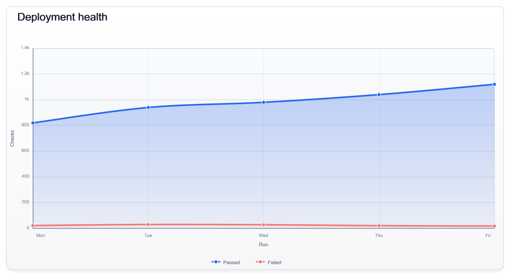

I kept running into the same problem while building reports and automation tools: the chart looked fine in a browser, but the real destination was an email, a PDF, a generated document, or even a desktop background. Bringing a browser runtime along just to draw the final image felt like the wrong tradeoff.

That is why I built [ChartForgeX](https://github.com/EvotecIT/ChartForgeX). You describe the visual with typed .NET objects and render it locally. The same model can produce SVG, static HTML, PNG, GIF, JPEG, BMP, PPM, or TIFF output, so I can use it from a web page and from a scheduled report without maintaining two chart definitions.

The name says "chart," but the project has grown into several related rendering surfaces:

- statistical and business chart series
- chart grids and small multiples
- exact-value blocks such as KPI cards, tables, lists, and timelines
- fixed-size layered canvases
- topology, organization hierarchies, maps, and relationship diagrams
- optional interactive HTML for charts and graph exploration
- Markdown and Mermaid-oriented authoring packages

I keep them separate on purpose. A KPI card is not a tiny bar chart, and a service dependency map should not have to pretend it is a chart series.

## One model, several delivery formats

Add the [ChartForgeX NuGet package](https://www.nuget.org/packages/ChartForgeX/1.7.0) to a .NET console project (`dotnet add package ChartForgeX --version 1.7.0`). A basic chart remains small:

```csharp
using ChartForgeX;
using ChartForgeX.Core;
using ChartForgeX.Primitives;
using System.Collections.Generic;

var chart = Chart.Create()
    .WithTitle("Deployment health")
    .WithXAxis("Run")
    .WithYAxis("Checks")
    .WithSize(1180, 640)
    .WithXLabels("Mon", "Tue", "Wed", "Thu", "Fri")
    .AddSmoothArea("Passed", Points(820, 940, 980, 1040, 1120))
    .AddSmoothLine(
        "Failed",
        Points(22, 30, 28, 21, 18),
        ChartColor.FromRgb(248, 113, 113));

chart.SaveSvg("deployment-health.svg");
chart.SaveHtml("deployment-health.html");
chart.SavePng("deployment-health.png");

static IEnumerable<ChartPoint> Points(params double[] values) {
    for (var index = 0; index < values.Length; index++) {
        yield return new ChartPoint(index + 1, values[index]);
    }
}
```



The output methods follow one simple pattern: `To*` returns content, `Save*` writes a file, and `Write*` streams bytes. I normally keep SVG for websites and other places where sharp text matters. PNG is the practical choice for email, Office documents, and systems that expect a normal image file. The HTML output wraps the SVG for direct browser delivery.

## Choose the right surface

Before choosing colors, I decide what the reader is supposed to learn from the visual.

For a trend, comparison, distribution, or statistical view, I start with `Chart`. `ChartGrid` keeps several related charts aligned. When the exact values matter more than an axis, `ChartForgeX.VisualBlocks` gives me cards, tables, lists, and timelines. For a fixed-size report cover, social card, or wallpaper, I use `VisualCanvas` or `ImageComposition`.

Relationships need a different model. `TopologyChart` works well for services, ownership, routes, maps, and organization data. When the graph is large enough to need navigation, selection, editing, or exploration, I move to `GraphScene`.


## Hierarchy without pretending every branch is identical

Organization charts are a good example of why one layout rule is not enough. A small demo looks fine, then real data arrives and one manager has fifteen direct reports. The branch becomes wider than the page, or wrapped cards start looking like another level in the hierarchy.

ChartForgeX lets me choose a policy for a single branch. Most of the tree can remain automatic, one busy branch can use a compact layout, and a narrow branch can run vertically. The policy is inherited, so I only describe the exceptions.

There are four choices:

- `Auto` selects a deterministic policy from branch density
- `Standard` uses a conventional row of direct reports
- `Compact` wraps a dense branch without inventing hierarchy
- `Vertical` keeps a narrow branch in a single column


## Topology is a reusable rendering concern

I have built service maps, Active Directory site diagrams, ownership views, and infrastructure graphs in different products. The source data changes, but the drawing problem does not: nodes, groups, edges, labels, status, routing, and layout all have to agree.

ChartForgeX owns that drawing model. The application maps its data into `TopologyChart` or `GraphScene`; ChartForgeX does not query Active Directory, calculate health, or decide what a red node means.


This keeps the useful part reusable. A reporting product still owns its filters and health rules. A directory tool still owns discovery. They simply hand the finished relationship model to the same renderer.

## Dependency-free core, optional browser behavior

The core ChartForgeX package has no runtime package dependencies, and static output does not need JavaScript. I wanted the basic result to work in reports, email, documentation, build jobs, and locked-down hosts.

Browser interaction lives in separate packages:

- `ChartForgeX.Interactivity` holds host-neutral interaction contracts
- `ChartForgeX.Interactivity.Html` adds browser behavior

I add the HTML adapter when the reader actually needs search, selection, zoom, hierarchy navigation, scenarios, or export controls. A static chart embedded in an HTML report can stay static.

## Where ChartForgeX stops

ChartForgeX does not build the dashboard shell, collect data, calculate Active Directory health, or define product-specific filters. Those decisions stay with the application using it.

For PowerShell users, [ImagePlayground](/projects/imageplayground/) wraps the engine in commands and examples. [PowerBGInfo](/projects/powerbginfo/) uses the same rendering code to compose Windows desktop backgrounds. I can improve the renderer once without turning either product into a thinly disguised chart library.

## Explore the full API

The [ChartForgeX project hub](/projects/chartforgex/) collects the material that used to be scattered between repositories and examples:

- [documentation](/projects/chartforgex/docs/) explains packages, rendering surfaces, topology, and interactivity
- [.NET API](/projects/chartforgex/api/) lists public types across the ChartForgeX packages
- [examples](/projects/chartforgex/examples/) provide short starting points and maintained gallery links
- the [generated gallery](https://evotecit.github.io/ChartForgeX/) shows the breadth of real output

If you are building a .NET application and want to own the data model while reusing the rendering work, start with the examples and the generated gallery. That is the job I want ChartForgeX to do: take a model your application understands and turn it into an output people can actually read.
