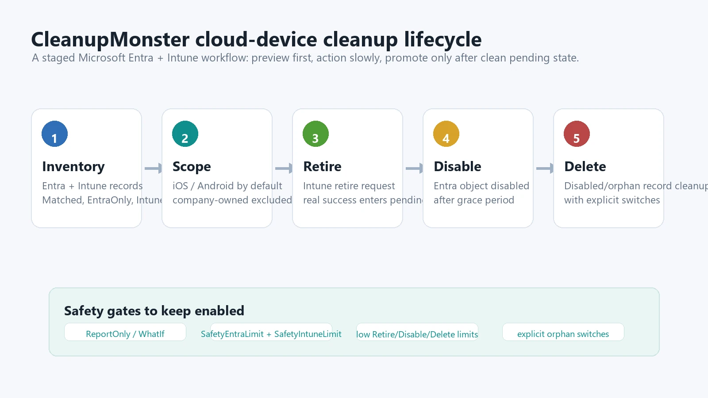
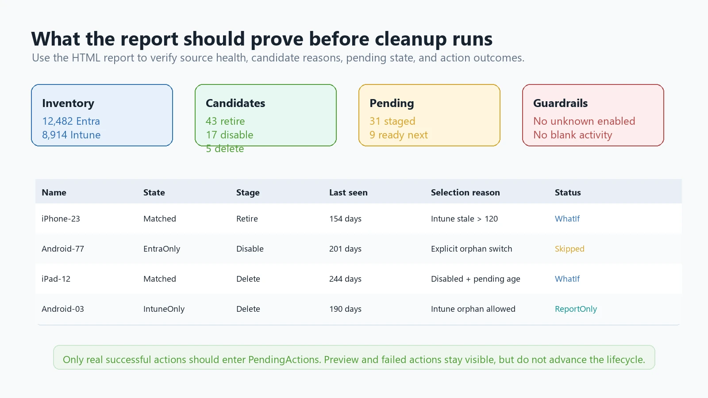
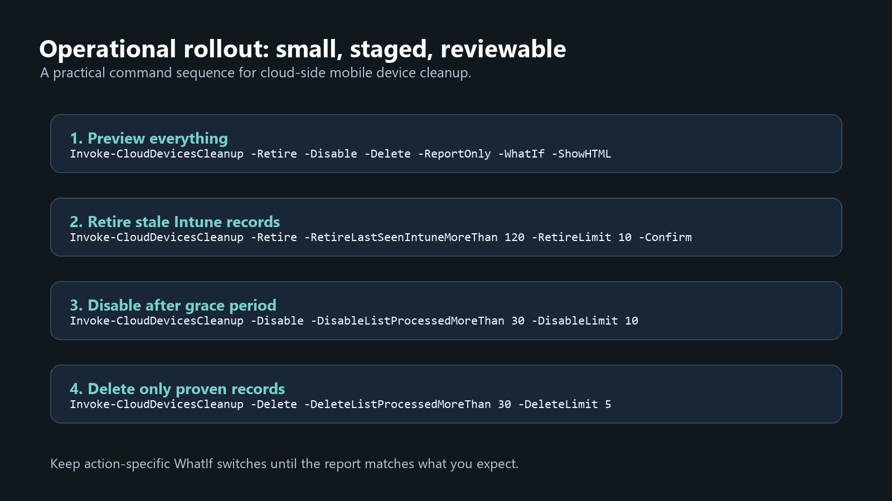

Stale mobile device records are easy to ignore because they rarely break anything immediately. A user changes phones, an enrollment fails, a device is retired manually, or an old Intune object stays behind after the Entra device object is gone. After a few years the tenant contains a mix of real devices, abandoned registrations, and orphaned records that nobody wants to delete by hand.

That is exactly the kind of cleanup where I do not want a five-line script. I want inventory, clear selection reasons, small limits, a pending list, and an HTML report I can review before anything destructive happens.

`CleanupMonster` now has a cloud-side workflow for Microsoft Entra registered mobile devices:

```powershell
Invoke-CloudDevicesCleanup
```

It is intentionally separate from Active Directory computer cleanup. Hybrid joined and synchronized devices have a different lifecycle and should normally be handled with `Invoke-ADComputersCleanup`. This cloud cleanup path is focused on stale Microsoft Entra registered `iOS` and `Android` devices, with Intune retire and Entra disable/delete stages.



## What the workflow does

The cmdlet builds a combined inventory from Microsoft Entra ID and Intune, then classifies device records into three states:

- `Matched`: a device appears in both Entra and Intune
- `EntraOnly`: an Entra registered device object exists without a matching Intune managed device
- `IntuneOnly`: an Intune managed device exists without a matching Entra device object

The cleanup stages are deliberately slow:

1. Retire stale Intune managed devices.
2. Store only real successful actions in `PendingActions`.
3. Disable Entra device objects after a grace period.
4. Delete only disabled or explicitly allowed orphan records after another grace period.

That staging matters. A stale-device cleanup process should not jump from "found old device" to "deleted object" in one run. You want time for the device to reappear, sync again, or prove that it really is abandoned.

## Prerequisites

Install the modules and connect to Microsoft Graph with the scopes needed for inventory and actions:

```powershell
Install-Module CleanupMonster -Force
Install-Module GraphEssentials -Force

Connect-MgGraph -Scopes `
    Device.Read.All, `
    Device.ReadWrite.All, `
    DeviceManagementManagedDevices.Read.All, `
    DeviceManagementManagedDevices.ReadWrite.All, `
    DeviceManagementManagedDevices.PrivilegedOperations.All
```

For a production scheduled task, store the Graph connection method and datastore path deliberately. The datastore is not decoration. It is how CleanupMonster knows when a device entered the pending workflow and whether enough time has passed for the next stage.

## Step 1. Run a full preview

Start with everything enabled, but make it report-only and WhatIf:

```powershell
$output = Invoke-CloudDevicesCleanup `
    -Retire `
    -Disable `
    -Delete `
    -ReportOnly `
    -WhatIf `
    -ShowHTML `
    -SafetyEntraLimit 1000 `
    -SafetyIntuneLimit 1000 `
    -DataStorePath "$PSScriptRoot\CloudDevices\ProcessedCloudDevices.xml" `
    -ReportPath "$PSScriptRoot\Reports\CloudDevices-Preview.html"

$output.CurrentRun |
    Format-Table Name, RecordState, Action, ActionStatus, SelectionReason -AutoSize
```

This first run should answer four questions:

- Did Graph return the number of Entra and Intune objects you expected?
- Are the selected devices really Microsoft Entra registered mobile devices?
- Are company-owned devices excluded unless you deliberately included them?
- Are orphan states visible in the report but not actioned by accident?



## Step 2. Retire stale Intune devices

Once the preview looks correct, retire stale Intune managed devices first:

```powershell
$output = Invoke-CloudDevicesCleanup `
    -Retire `
    -RetireLastSeenIntuneMoreThan 120 `
    -RetireLimit 10 `
    -SafetyIntuneLimit 1000 `
    -DataStorePath "$PSScriptRoot\CloudDevices\ProcessedCloudDevices.xml" `
    -ReportPath "$PSScriptRoot\Reports\CloudDevices-Retire.html" `
    -LogPath "$PSScriptRoot\Logs\CloudDevices-Retire.log" `
    -ShowHTML `
    -Confirm

$output.CurrentRun |
    Format-Table Name, RecordState, ManagedDeviceId, ActionStatus, SelectionReason -AutoSize
```

Only real successful retire actions are added to `PendingActions`. `-ReportOnly`, top-level `-WhatIf`, and `-WhatIfRetire` are shown in the current report but do not advance the cleanup lifecycle.

That distinction is important. A preview should help you review candidates, not make the next scheduled run think a device was already retired.

## Step 3. Disable after the pending period

After the pending period, run the disable stage:

```powershell
$output = Invoke-CloudDevicesCleanup `
    -Disable `
    -DisableListProcessedMoreThan 30 `
    -DisableLimit 10 `
    -SafetyEntraLimit 1000 `
    -DataStorePath "$PSScriptRoot\CloudDevices\ProcessedCloudDevices.xml" `
    -ReportPath "$PSScriptRoot\Reports\CloudDevices-Disable.html" `
    -LogPath "$PSScriptRoot\Logs\CloudDevices-Disable.log" `
    -WhatIfDisable `
    -ShowHTML
```

Keep `-WhatIfDisable` until you trust the report. Entra-backed disable candidates require `Enabled -eq $true`. If Graph does not return a known enabled state, CleanupMonster treats that device as unsafe and skips it.

The pending gate also checks activity. If a device had activity when it was staged and the current inventory shows newer activity, the device is not promoted to the next destructive stage. If current activity disappears where it previously existed, that is treated as unsafe as well.

## Step 4. Delete only proven records

Deletion should be the last stage:

```powershell
$output = Invoke-CloudDevicesCleanup `
    -Delete `
    -DeleteListProcessedMoreThan 30 `
    -DeleteLimit 5 `
    -DeleteRemoveIntuneRecord $true `
    -SafetyEntraLimit 1000 `
    -SafetyIntuneLimit 1000 `
    -DataStorePath "$PSScriptRoot\CloudDevices\ProcessedCloudDevices.xml" `
    -ReportPath "$PSScriptRoot\Reports\CloudDevices-Delete.html" `
    -LogPath "$PSScriptRoot\Logs\CloudDevices-Delete.log" `
    -WhatIfDelete `
    -ShowHTML

$output.CurrentRun |
    Format-Table Name, RecordState, ActionStatus, ActionNotes -AutoSize
```

For Entra-backed records, delete requires `Enabled -eq $false`. That forces a disable-before-delete pattern instead of deleting enabled device objects just because their timestamps look old.

If you want to process orphan records, make that decision explicit:

```powershell
Invoke-CloudDevicesCleanup `
    -Delete `
    -DeleteIncludeEntraOnly `
    -DeleteIncludeIntuneOnly `
    -DeleteRemoveIntuneRecord $true `
    -DeleteLastSeenIntuneMoreThan 180 `
    -DeleteLimit 5 `
    -WhatIfDelete `
    -ShowHTML
```

I prefer to review orphan states in reports first, then enable orphan switches one by one. The fact that something is orphaned does not always mean it is safe to delete immediately.



## A safer scheduled profile

After manual validation, the scheduled profile can be kept boring:

```powershell
$configuration = @{
    Retire                       = $true
    RetireLastSeenIntuneMoreThan = 120
    RetireLimit                  = 10

    Disable                      = $true
    DisableListProcessedMoreThan = 30
    DisableLimit                 = 10

    Delete                       = $true
    DeleteListProcessedMoreThan  = 30
    DeleteLimit                  = 5
    DeleteRemoveIntuneRecord     = $true

    IncludeOperatingSystem       = @('iOS*', 'Android*')
    IncludeCompanyOwned          = $false

    SafetyEntraLimit             = 1000
    SafetyIntuneLimit            = 1000

    DataStorePath                = "$PSScriptRoot\CloudDevices\ProcessedCloudDevices.xml"
    ReportPath                   = "$PSScriptRoot\Reports\CloudDevices-$((Get-Date).ToString('yyyy-MM-dd_HH_mm_ss')).html"
    LogPath                      = "$PSScriptRoot\Logs\CloudDevices-$((Get-Date).ToString('yyyy-MM-dd_HH_mm_ss')).log"

    WhatIfRetire                 = $true
    WhatIfDisable                = $true
    WhatIfDelete                 = $true
    ShowHTML                     = $true
}

$output = Invoke-CloudDevicesCleanup @configuration
```

Remove the action-specific WhatIf switches gradually. Do not remove all of them at once on the first production run.

## What to watch for

The most common misconception is that "old timestamp" means "safe to delete." With Entra and Intune data, missing or stale timestamps can be caused by reporting gaps, enrollment state, device platform behavior, or incomplete permissions. CleanupMonster treats blank activity as unsafe for destructive selection because false confidence is worse than a noisy report.

The other misconception is that orphan records should be auto-cleaned. Orphans are useful signals, but they deserve review. `EntraOnly` and `IntuneOnly` records can be selected, but only when you enable the matching switches.

## Wrap-up

The point of this workflow is not to delete more aggressively. It is to make cloud-device hygiene repeatable:

- discover Entra and Intune records together
- explain why a device was selected
- retire first
- wait
- disable before delete
- keep reports and logs for review

If your tenant has years of stale mobile-device registrations, start with the preview command and spend time reading the report. The cleanup part is easy. The decision process is where the safety lives.
