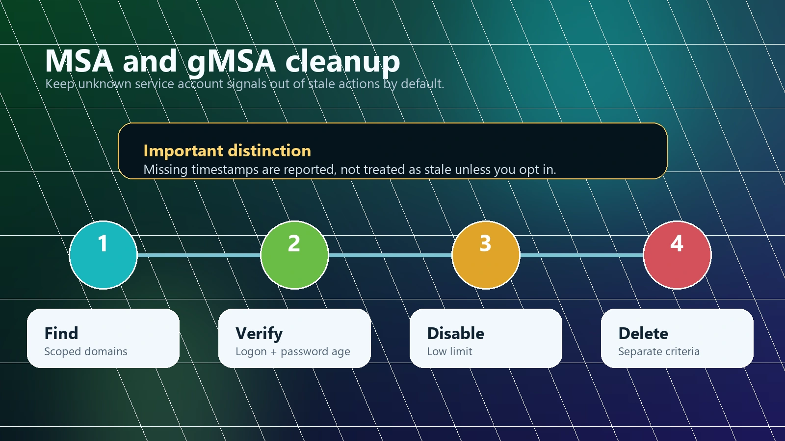
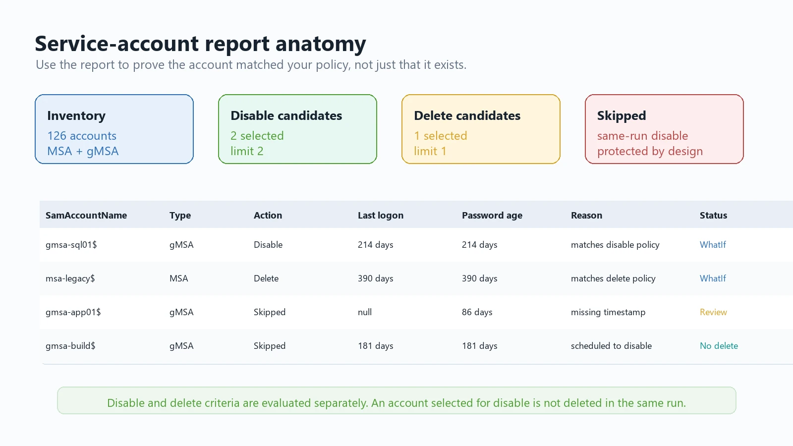
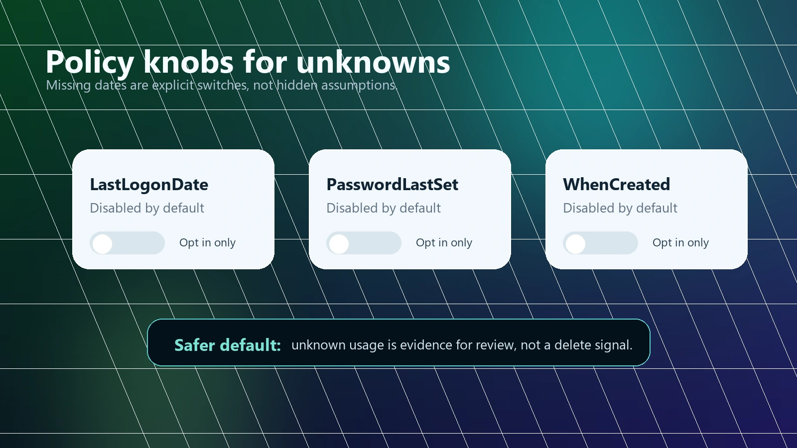

Managed service accounts are one of those Active Directory features that are both very useful and very easy to forget about. A team creates a gMSA for SQL Server, another one for an application pool, someone tests an MSA years ago, and then servers are rebuilt, applications move, and nobody is quite sure whether the account is still in use.

The wrong cleanup approach is simple:

```powershell
Get-ADServiceAccount -Filter * | Remove-ADObject
```

That is also how you get an outage with very little warning.

`CleanupMonster` now includes a safer workflow for stale `MSA` and `gMSA` objects:

```powershell
Invoke-ADServiceAccountsCleanup
```

The goal is not to make service-account deletion easy. The goal is to make it reviewable, limited, and deliberate.



## Why MSA and gMSA cleanup needs a different mindset

Managed service accounts are not ordinary user accounts. They are usually attached to services, scheduled tasks, IIS application pools, SQL services, or other server-side workloads. A stale-looking timestamp does not always tell the whole story.

That is why this cleanup path is intentionally narrower than the computer cleanup workflow:

- destructive runs require explicit selectors or age filters
- `DisableLimit` and `DeleteLimit` default to `1`
- an account selected for disable is not deleted in the same run
- missing timestamps are not treated as stale unless you explicitly enable that policy
- `ReportOnly` and `WhatIf` should be your first runs

This is a cleanup job where boring is good.

## Prerequisites

Install the module and run it from a machine that can query Active Directory:

```powershell
Install-Module CleanupMonster -Force
Import-Module CleanupMonster
```

For reporting-only runs you still need enough permission to read the attributes you use in your filters. In many environments that includes `LastLogonDate`, `PasswordLastSet`, `WhenCreated`, `Enabled`, and the service account distinguished name. If the environment has delegated or hardened reads, validate the report before trusting the candidate list.

## Step 1. Start with a report-only run

The first run should not change anything:

```powershell
$output = Invoke-ADServiceAccountsCleanup `
    -Disable `
    -Delete `
    -DisableLastLogonDateMoreThan 90 `
    -DeleteLastLogonDateMoreThan 180 `
    -IncludeAccounts @('gmsa-*', 'msa-*') `
    -ReportOnly `
    -ReportPath "$PSScriptRoot\Reports\ServiceAccounts-Preview.html" `
    -ShowHTML

$output.CurrentRun |
    Format-Table SamAccountName, ObjectClass, Action, ActionStatus, LastLogonDays -AutoSize
```

This gives you a candidate list without touching AD. Review it with the application owners before you enable real actions.



## Step 2. Use explicit account scope

I recommend starting with `IncludeAccounts` even when you also use age filters:

```powershell
Invoke-ADServiceAccountsCleanup `
    -Disable `
    -DisableLastLogonDateMoreThan 90 `
    -IncludeAccounts @('gmsa-sql-*', 'gmsa-iis-*') `
    -ExcludeAccounts @('gmsa-sql-prod-*', 'gmsa-keep-*') `
    -DisableLimit 2 `
    -WhatIfDisable `
    -ReportPath "$PSScriptRoot\Reports\ServiceAccounts-Scoped.html" `
    -ShowHTML
```

Name patterns are not perfect, but they make intent visible. A broad forest-wide service account cleanup is harder to explain and much harder to review.

## Step 3. Decide how to handle missing timestamps

This is the part that deserves attention.

For computers, missing logon or password timestamps are often treated as "never used." With service accounts, that assumption can be too aggressive. A gMSA may not produce the same operational signals you expect from a normal user account, and different services can make the audit trail uneven.

CleanupMonster therefore does not treat missing `LastLogonDate`, `PasswordLastSet`, or `WhenCreated` as stale by default when the matching age filter is used.

If your policy says missing values should count as stale, say so explicitly:

```powershell
Invoke-ADServiceAccountsCleanup `
    -Disable `
    -DisableLastLogonDateMoreThan 90 `
    -DisableTreatMissingLastLogonDateAsStale `
    -IncludeAccounts 'gmsa-lab-*' `
    -DisableLimit 1 `
    -WhatIfDisable `
    -ShowHTML
```

There are separate switches for disable and delete policies:

```powershell
-DisableTreatMissingLastLogonDateAsStale
-DisableTreatMissingPasswordLastSetAsStale
-DisableTreatMissingWhenCreatedAsStale

-DeleteTreatMissingLastLogonDateAsStale
-DeleteTreatMissingPasswordLastSetAsStale
-DeleteTreatMissingWhenCreatedAsStale
```

That makes the report more honest. Missing data becomes a policy decision, not a hidden assumption.



## Step 4. Disable before delete

For most environments, the first real action should be disable:

```powershell
$configuration = @{
    Disable                        = $true
    DisableLastLogonDateMoreThan   = 90
    DisablePasswordLastSetMoreThan = 90
    DisableLimit                   = 2

    IncludeAccounts                = @('gmsa-*', 'msa-*')
    ExcludeAccounts                = @('gmsa-keep-*')
    SafetyADLimit                  = 10

    ReportPath                     = "$PSScriptRoot\Reports\ServiceAccounts-Disable.html"
    LogPath                        = "$PSScriptRoot\Logs\ServiceAccounts-Disable.log"
    WhatIfDisable                  = $true
    ShowHTML                       = $true
}

$output = Invoke-ADServiceAccountsCleanup @configuration
```

Remove `WhatIfDisable` only after the report is boring and expected. Keep the limit low for the first scheduled runs.

## Step 5. Delete with separate criteria

Deletion should have stricter criteria than disabling:

```powershell
$configuration = @{
    Delete                         = $true
    DeleteLastLogonDateMoreThan    = 180
    DeletePasswordLastSetMoreThan  = 180
    DeleteLimit                    = 1

    IncludeAccounts                = @('gmsa-*', 'msa-*')
    ExcludeAccounts                = @('gmsa-keep-*')
    SafetyADLimit                  = 10

    ReportPath                     = "$PSScriptRoot\Reports\ServiceAccounts-Delete.html"
    LogPath                        = "$PSScriptRoot\Logs\ServiceAccounts-Delete.log"
    WhatIfDelete                   = $true
    ShowHTML                       = $true
}

$output = Invoke-ADServiceAccountsCleanup @configuration
```

If you enable both disable and delete in the same run, CleanupMonster will not delete an account that was already selected for disable in that same invocation:

```powershell
Invoke-ADServiceAccountsCleanup `
    -Disable `
    -Delete `
    -DisableLastLogonDateMoreThan 90 `
    -DeleteLastLogonDateMoreThan 180 `
    -DisableLimit 2 `
    -DeleteLimit 1 `
    -IncludeAccounts @('gmsa-*', 'msa-*') `
    -WhatIfDisable `
    -WhatIfDelete `
    -ShowHTML
```

That protects you from accidentally doing "disable and delete now" just because the same object matches both sets of criteria.

## A scheduled cleanup profile

After several manual runs, a scheduled profile can look like this:

```powershell
$configuration = @{
    Disable                        = $true
    DisableLastLogonDateMoreThan   = 120
    DisablePasswordLastSetMoreThan = 120
    DisableLimit                   = 2

    Delete                         = $true
    DeleteLastLogonDateMoreThan    = 240
    DeletePasswordLastSetMoreThan  = 240
    DeleteLimit                    = 1

    IncludeAccounts                = @('gmsa-*', 'msa-*')
    ExcludeAccounts                = @(
        'gmsa-prod-*'
        'gmsa-keep-*'
    )

    SafetyADLimit                  = 10
    ReportPath                     = "$PSScriptRoot\Reports\ServiceAccounts-$((Get-Date).ToString('yyyy-MM-dd_HH_mm_ss')).html"
    LogPath                        = "$PSScriptRoot\Logs\ServiceAccounts-$((Get-Date).ToString('yyyy-MM-dd_HH_mm_ss')).log"

    WhatIfDisable                  = $true
    WhatIfDelete                   = $true
    ShowHTML                       = $true
}

$output = Invoke-ADServiceAccountsCleanup @configuration
```

Remove the action-specific WhatIf switches one at a time after application owners confirm the selected accounts are safe to process.

## What to review with application owners

Before disabling or deleting a managed service account, try to answer:

- Which service, scheduled task, application pool, or application used this account?
- Which servers are allowed to retrieve the gMSA password?
- Is the account referenced in documentation, deployment scripts, or old monitoring configuration?
- Was the workload migrated, retired, or renamed?
- Is missing timestamp data expected for this account type?
- Can we disable first and wait through at least one maintenance cycle?

CleanupMonster can make the candidate list cleaner. It cannot know the business owner of every old application.

## Wrap-up

MSA and gMSA cleanup is not glamorous, but it is worth doing carefully. Stale service accounts add noise, confuse audits, and make it harder to understand which identities are still needed.

The safe pattern is simple:

- scope the account names
- preview with `ReportOnly` and `WhatIf`
- treat missing timestamps as a policy decision
- keep limits low
- disable before delete
- review the report after every run

Once the workflow is proven, CleanupMonster gives you a repeatable process instead of a risky one-off script.
