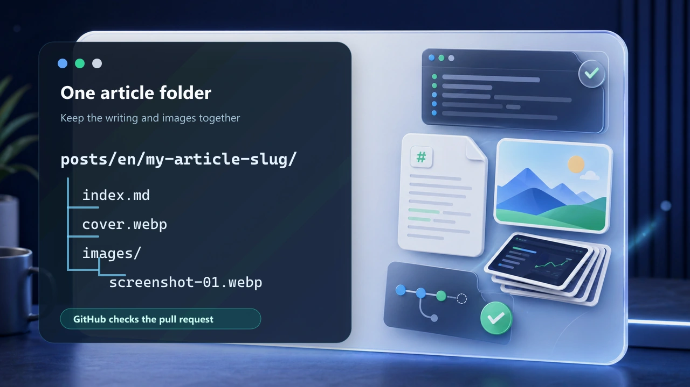

evotec.xyz has always been built around practical engineering notes: scripts that solved a real problem, migration lessons, odd edge cases, and the kind of PowerShell details that save someone else an afternoon.

If you have something useful to share, you do not need access to the private website repository. Write the article in this public contribution repo, open a pull request, and we will review it there. Once it is accepted, maintainers import it into the production site.

The goal is simple: make writing approachable, keep review predictable, and give proper credit to the people who help make the site better.


## 1. Keep Each Article In One Folder

Put the Markdown file, cover image, and screenshots in the same article folder:



Use this shape:

```text
posts/en/my-article-slug/
  index.md
  cover.webp
  images/
    screenshot-01.webp
```

The first folder after `posts/` is the language. The next folder is the article slug. Everything used by that article stays inside that folder.

That small bit of structure makes the whole process calmer. Reviewers can see the article and its images together, and the publishing importer can copy everything into stable website paths without guessing where files belong.

## 2. Tell Readers Who You Are

Every writer gets an author profile in `authors/<author-slug>.yml`. Your article references that slug:

```yaml
authors:
  - your-name
```

Author profiles can include your role, X profile, LinkedIn profile, and personal website. If you helped write the article, you should get visible credit for it.

## 3. Use Images That Belong To The Article

Use local relative image links in Markdown:

```markdown

```

Please keep images local to the article folder. Remote images disappear, change, or track readers in ways we do not want. Screenshots should be cropped to the thing you are explaining, and any personal, customer, tenant, or secret data should be removed before you open a pull request.


## 4. Open A Pull Request

When the article feels ready, open a pull request from your fork. GitHub Actions will check the post structure, author profile, image paths, alt text, and file sizes automatically.

From there, we review it like any other contribution. Sometimes that means a quick merge. Sometimes we may ask for a clearer screenshot, a safer example, or a little more context. Once the post is accepted, maintainers import it into evotec.xyz and keep the production site controlled from the private repository.

That is the whole idea: a public place to write, a protected path to publish, and a better way for people to share useful work with the Evotec community.
