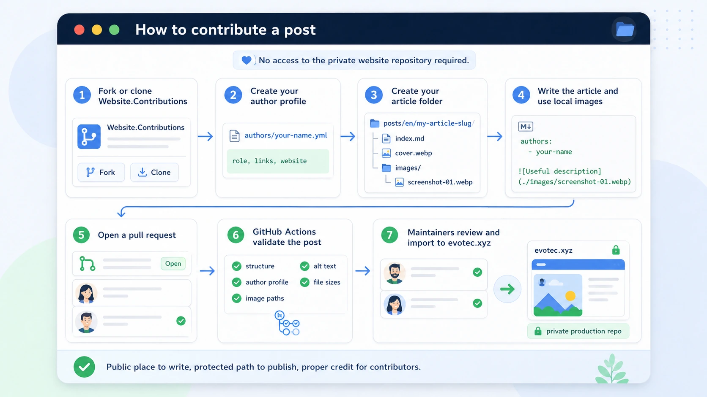
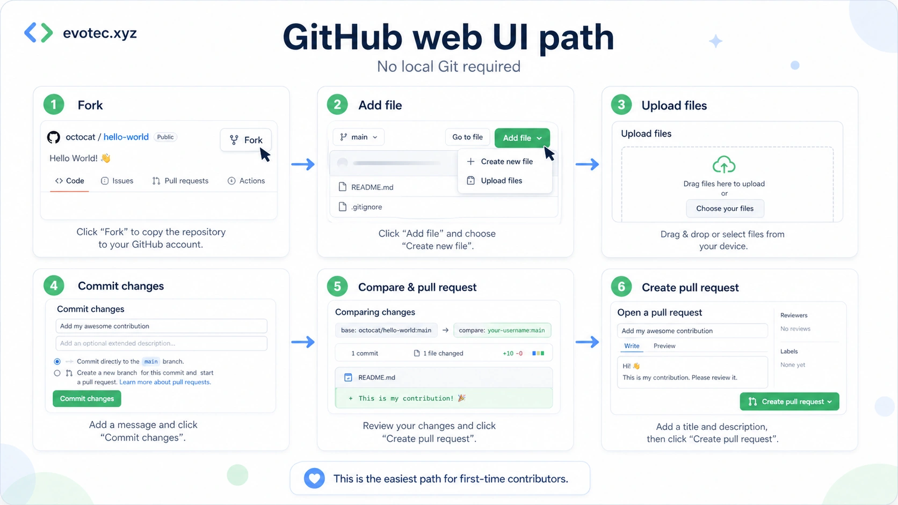
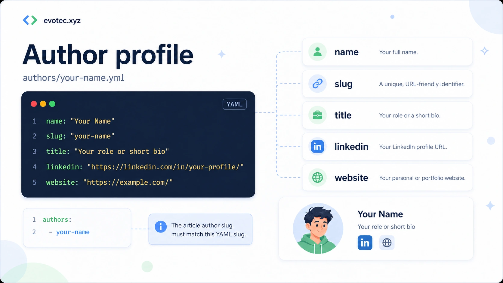
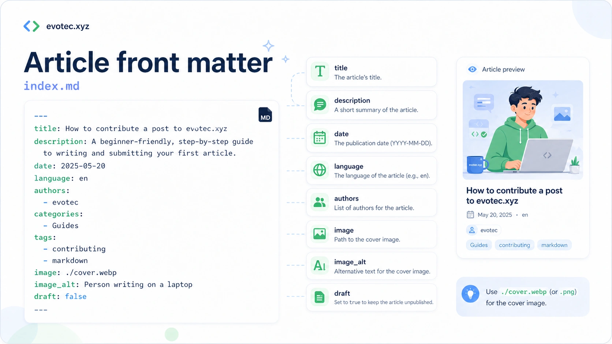
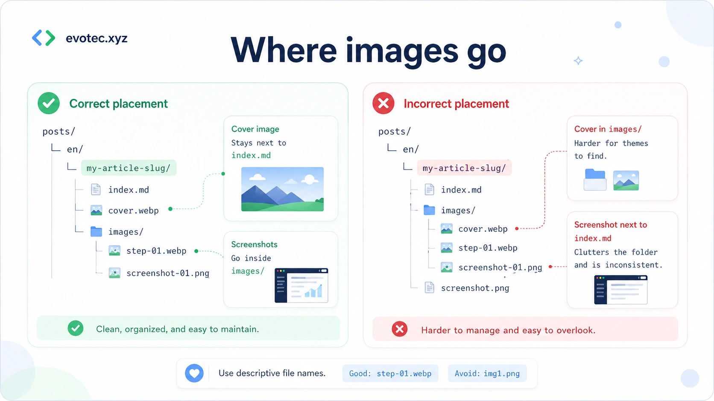
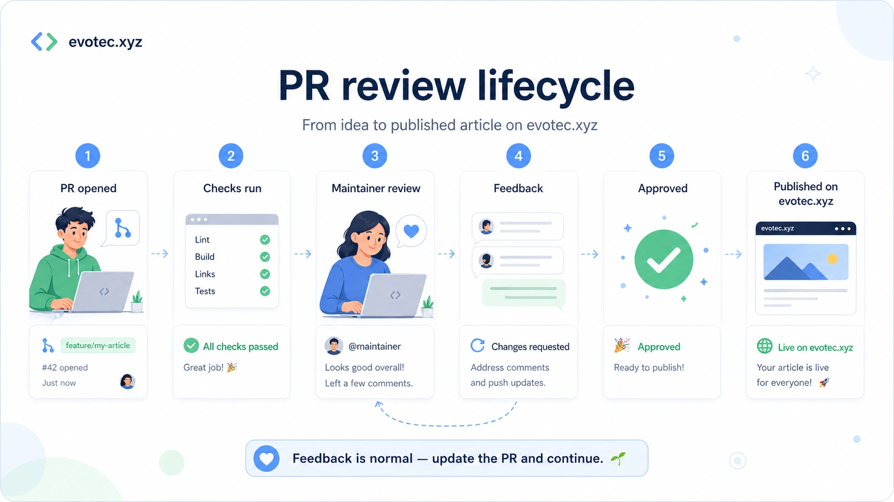
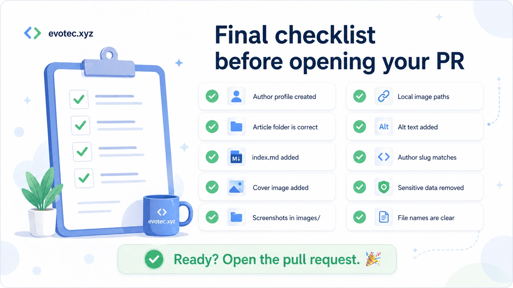

evotec.xyz has always been built around practical engineering notes: scripts that solved a real problem, migration lessons, unusual edge cases, troubleshooting notes, and the kind of PowerShell or Microsoft detail that can save someone else an afternoon.

If you have something useful to share, you do **not** need access to the private production website repository.

Instead, you write the article in the public **Website.Contributions** repository, open a pull request, and maintainers review it there. Once the article is accepted, maintainers import it into the production website.

The goal is simple:

- make contributing approachable
- keep review predictable
- protect the production website
- give proper credit to contributors
- help more people share practical engineering knowledge



## Quick Version

If you already know GitHub and Markdown, this is the short version:

1. Fork the `Website.Contributions` repository.
2. Create your author profile in `authors/<your-slug>.yml`.
3. Create your article folder in `posts/<language>/<article-slug>/`.
4. Add `index.md`, a cover image, and an `images/` folder for screenshots and article images.
5. Write the article in Markdown.
6. Use local image paths only.
7. Commit your changes.
8. Open a pull request.
9. Fix validation issues if GitHub Actions reports any.
10. Wait for review.

If you are new to GitHub, Markdown, or pull requests, the rest of this guide walks through the process step by step.

---

## Who This Guide Is For

This guide is for:

- first-time contributors
- people who have never opened a pull request
- people who are not sure how the article folder should look
- people who do not know where images go
- people who want a safe, repeatable process

You do **not** need to be an expert writer. A focused, practical article is usually more useful than a long, abstract one.

Good topics include:

- PowerShell scripts that solved a real problem
- Microsoft 365, Entra ID, Exchange, Active Directory, Intune, Azure, or security lessons
- migration notes
- troubleshooting stories
- unusual edge cases
- monitoring ideas
- dashboards and reports
- automation patterns
- open-source usage
- lessons learned from production work

---

## Step 1: Open the Repository

Start with the public contribution repository:

```text
https://github.com/EvotecIT/Website.Contributions
```

You will need a GitHub account.

Once you are on the repository page, you have two common ways to work.

### Option A — easiest for beginners

Use the **GitHub web interface** in the browser.

This is the easiest option if:

- you do not want to install Git
- you do not want to use command line tools
- you want to keep everything simple

### Option B — local editing

Clone the repository to your computer and edit locally using tools like:

- Visual Studio Code
- Git
- PowerShell
- your normal editor

If you are not sure which path to choose, use **Option A** first.



---

## Step 2: Fork the Repository

Click **Fork** on GitHub.

A fork creates your own copy of the repository under your GitHub account, so you can edit it safely.

In simple terms:

- the original repository stays unchanged
- you work in your own copy
- when you are ready, you open a pull request back to the original repository

This keeps the contribution process safe and predictable.

---

## Step 3: Choose the Article Language

Articles live under:

```text
posts/<language>/<article-slug>/
```

The first folder after `posts/` is the language.

Examples:

```text
posts/en/my-article-slug/
posts/pl/moj-artykul/
```

Use:

- `en` for English
- `pl` for Polish

Other website interface languages may exist, but blog contribution intake should stay in `en` or `pl` unless maintainers extend the workflow. If you are unsure, use **English**.

Examples:

```text
posts/en/how-to-check-dns-records/
posts/pl/jak-sprawdzic-rekordy-dns/
```

---

## Step 4: Create Your Author Profile

Every contributor should have an author profile.

Create a file in the `authors` folder:

```text
authors/your-name.yml
```

Example:

```yaml
name: "Your Name"
slug: "your-name"
title: "Your role or short bio"
x: "https://x.com/your-handle"
linkedin: "https://www.linkedin.com/in/your-profile/"
website: "https://example.com/"
```

You do **not** need every field. If you do not use X, LinkedIn, or a personal website, leave out that field.

A smaller valid example can look like this:

```yaml
name: "Your Name"
slug: "your-name"
title: "PowerShell enthusiast and Microsoft engineer"
website: "https://example.com/"
```

The most important rule is that the `slug` from the author file must match the author value used in the article front matter.

Example:

```yaml
authors:
  - your-name
```

If those values do not match, validation may fail or the article may not link to the author correctly.



---

## Step 5: Create the Article Folder

Each article should live in its own folder.

Use this shape:

```text
posts/en/my-article-slug/
  index.md
  cover.webp
  images/
    screenshot-01.webp
```

The structure means:

- `posts/` — all posts
- `en/` — the article language
- `my-article-slug/` — the unique article folder
- `index.md` — the article itself
- `cover.webp` — the cover image
- `images/` — screenshots and other article-specific images


Keep **everything for one article together** in the same article folder.

That makes review easier and avoids confusion when maintainers import the article into the production website.

---

## Step 6: Pick a Good Article Slug

The slug is the folder name used for your article.

Good slugs are:

- lowercase
- words separated by hyphens
- short but descriptive
- stable

Good examples:

```text
how-to-check-dns-records
find-stale-ad-computers
troubleshooting-exchange-mail-flow
```

Avoid:

```text
MyArticle
article1
test-post
new-final-version
```

A good slug should describe the topic clearly.

---

## Step 7: Create `index.md`

Inside the article folder, create:

```text
index.md
```

That file contains the article front matter and the actual content.

Here is a beginner-friendly starter template:

```markdown
---
title: "Your Article Title"
description: "A short summary of what the article explains."
date: "2026-04-29"
language: "en"
authors:
  - your-name
categories:
  - PowerShell
tags:
  - powershell
  - automation
image: "./cover.webp"
image_alt: "Describe what the cover image shows"
draft: true
---

Start with a short introduction.

Explain what problem you had, why it mattered, and what the reader will learn.

## The Problem

Describe the situation clearly.

## The Solution

Explain the solution step by step.

## Example

Add code, screenshots, commands, or configuration examples.

## Result

Show what the reader should expect.

## Wrap-Up

Summarize the lesson and mention anything important to remember.
```

The front matter fields at the top describe the article.

Common fields are:

- `title` — the article title
- `description` — a short summary
- `date` — publication or preparation date
- `language` — article language, for example `en`
- `authors` — one or more author slugs
- `categories` — broader grouping
- `tags` — searchable keywords
- `image` — path to the cover image
- `image_alt` — alt text for the cover image
- `draft` — whether the post is still a draft



---

## Step 8: Add the Cover Image

Place the cover image next to `index.md`.

For example:

```text
posts/en/my-article-slug/
  index.md
  cover.webp
```

Accepted formats:

```text
.webp
.png
.jpg
.jpeg
.gif
```

Prefer **`.webp`** when possible because it usually gives good quality with smaller file sizes.

Use **`.png`** when:

- the image contains small text that must stay extremely sharp
- the image is a diagram and `.webp` makes it blurry
- the image contains UI elements or code that becomes hard to read in another format

If your cover is a normal illustration or banner, `.webp` is usually the best choice.

Preferred cover filename:

```text
cover.webp
```

Also acceptable if needed:

```text
cover.png
cover.jpg
cover.jpeg
cover.gif
```

---

## Step 9: Add Screenshots and Other Images

Put screenshots in the `images/` folder inside the article folder.

Example:

```text
posts/en/my-article-slug/
  index.md
  cover.webp
  images/
    screenshot-01.webp
    powershell-output.png
    admin-center-setting.webp
```

Use descriptive names.

Good names:

```text
images/install-module-command.webp
images/powershell-output.png
images/entra-admin-center-setting.webp
```

Avoid names like:

```text
images/image1.png
images/final.png
images/test2.webp
```

Descriptive names help reviewers and future maintainers understand what each file is for.



---

## Step 10: Link Images in Markdown

Use **local relative paths only**.

Good example:

```markdown

```

Also good:

```markdown

```

Avoid remote images:

```markdown

```

Remote images are a bad fit because they can:

- disappear
- change
- be slow
- track readers
- break the article later

### Alt Text Matters

Try to describe what the image shows.

Good:

```markdown

```

Weak:

```markdown

```

Alt text helps with accessibility and also makes the content more understandable when images do not load.

---

## Step 11: Write the Article in a Practical Way

The best articles are practical and focused.

A useful structure is:

1. What was the problem?
2. Why did it matter?
3. What did you do?
4. What commands or steps were used?
5. What result did you get?
6. What should the reader watch out for?

That often turns into sections like this:

```markdown
## The Problem
## Requirements
## Step-by-Step Solution
## Code Example
## Result
## Common Pitfalls
## Wrap-Up
```

Useful writing tips:

- keep paragraphs readable
- show exact commands when possible
- prefer real examples over vague advice
- explain portal paths clearly
- include screenshots if they help
- include expected output when useful
- mention permissions or requirements when they matter
- explain common mistakes

Example of a helpful portal path:

```text
Microsoft Entra admin center
Identity > Applications > Enterprise applications > Consent and permissions
```

That kind of detail saves readers time.

---

## Step 12: Remove Sensitive Information

Before you commit anything, review all screenshots and examples carefully.

Remove or blur:

- customer names
- tenant names
- internal hostnames
- private IP addresses if not needed
- email addresses
- tokens
- secrets
- passwords
- license keys
- personal data
- internal incident details that should not be public

Where possible, use:

- demo data
- lab environments
- redacted screenshots
- fake sample values

This matters a lot for technical and security-related articles.

---

## Step 13: Commit Your Changes

How you do this depends on how you are editing.

### If you use GitHub in the browser

When you add or edit files, GitHub will offer a **Commit changes** button.

Write a short commit message such as:

```text
Add article about checking DNS records with PowerShell
```

Then commit the changes to your fork.

### If you work locally

Typical commands look like this:

```powershell
git add .
git commit -m "Add article about checking DNS records with PowerShell"
git push
```

That pushes your work to your fork on GitHub.

---

## Step 14: Open a Pull Request

Once your changes are in your fork, open a pull request.

In simple terms, a pull request says:

> I made these changes in my fork and I would like maintainers to review them.

A good pull request title might be:

```text
Add article: How to check DNS records with PowerShell
```

A useful pull request description can be short:

```text
This PR adds a new article about checking DNS records with PowerShell.
It includes the article markdown, cover image, screenshots, and author profile.
```



---

## Step 15: Wait for Validation Checks

After the pull request is opened, GitHub Actions validates the contribution automatically.

Typical checks may include:

- article structure
- author profile presence
- image paths
- alt text
- file sizes
- expected folder layout

If a check fails, do not panic.

Usually it means something small needs to be corrected.

Common examples:

- missing author file
- wrong author slug
- broken image path
- missing alt text
- wrong folder structure
- image file too large
- article missing a required field

Fix the problem, commit again, and the pull request will update.

---

## Step 16: Respond to Review Feedback

Sometimes a pull request is ready quickly.

Other times, maintainers may ask for improvements such as:

- clearer title
- better description
- safer screenshots
- more context
- better image naming
- cleaner formatting
- clearer alt text

That is a normal part of the process.

The goal is not to make contributing difficult. The goal is to make the final post safe, useful, and easy to publish.

---

## Step 17: What Happens After Approval

If the article is accepted:

- maintainers merge or accept the contribution
- maintainers import it into the production website
- the production website remains controlled from the private repository
- your author credit stays attached to the article

You do **not** need access to the private production repository.

That part is handled by maintainers.

---

## GitHub Web UI Path for Total Beginners

If you want the simplest possible approach, here is the beginner path:

1. Open the repository on GitHub.
2. Click **Fork**.
3. Open your fork.
4. Go to `authors/`.
5. Create `your-name.yml`.
6. Go to `posts/en/` for English or `posts/pl/` for Polish.
7. Create your article folder.
8. Add `index.md`.
9. Upload `cover.webp`, or another accepted local image format if needed.
10. Create `images/`.
11. Upload screenshots into `images/`.
12. Commit changes.
13. Open a pull request.
14. Wait for checks.
15. Respond to feedback if needed.

This path is slower than local editing, but it is very friendly for first-time contributors.

---

## Optional: Local Editing Path

If you prefer to work locally, the process is still simple:

1. Fork the repository on GitHub.
2. Clone your fork locally.
3. Create the author profile.
4. Create the article folder.
5. Add `index.md`.
6. Add the cover image and screenshots.
7. Commit and push.
8. Open a pull request.

The folder structure remains exactly the same.

---

## Example Final Structure

Here is a complete example:

```text
authors/your-name.yml

posts/en/how-to-check-dns-records/
  index.md
  cover.webp
  images/
    powershell-output.png
    dns-zone-result.webp
    admin-center-setting.webp
```

And here is how the article references the author:

```yaml
authors:
  - your-name
```

And here is how it references an image:

```markdown

```

---

## FAQ

### Do I need access to the private website repository?

No. You only need the public contribution repository.

### Can I write in English?

Yes.

### Can I write in Polish?

Yes. Use `posts/pl/` for Polish articles. The current blog contribution intake uses `en` and `pl`.

### Should I use `.webp` or `.png`?

Use `.webp` when possible. Use `.png` when image clarity, sharp text, or diagram precision matters more. The validator also accepts `.jpg`, `.jpeg`, and `.gif` when those formats are a better fit.

### Do I need to install Git?

No, not if you use the GitHub web interface.

### Can I contribute even if I am new to Markdown?

Yes. A simple, clearly structured article is enough.

### Can I update the article after opening the pull request?

Yes. Add more commits to your branch or update the files in GitHub. The pull request will update automatically.

### What if GitHub Actions fails?

Open the failed check, read the message, fix the issue, and commit again.

### Can I add more than one author?

Yes, if the repository and article format support it. Use multiple slugs in the `authors` section.

Example:

```yaml
authors:
  - your-name
  - second-author
```

### Can I submit an article without screenshots?

Yes, if screenshots are not needed. If screenshots help explain the topic, include them.

### Can I use remote image URLs?

No. Keep images local to the article folder.

---

## Troubleshooting

### My image is not showing

Check:

- the file exists
- the filename matches exactly
- the path is correct
- the extension is correct
- you referenced `./images/...` if the file is inside `images/`

### My author profile is not linked

Check:

- the author file exists in `authors/`
- the slug is correct
- the article uses the same slug in front matter

### I am not sure where the cover image goes

The cover image goes next to `index.md`, not inside `images/`.

Correct:

```text
posts/en/my-article-slug/
  index.md
  cover.webp
  images/
```

### I am not sure where screenshots go

Screenshots go inside `images/`.

### I am not sure what language folder to use

Use `en` for English and `pl` for Polish. If you are unsure, use `en`.

---



## Final Checklist Before Opening a Pull Request

Before you open the pull request, check this list:

- [ ] I created or updated my author profile in `authors/`
- [ ] My article is inside `posts/<language>/<article-slug>/`
- [ ] The article file is named `index.md`
- [ ] The cover image is next to `index.md`
- [ ] Screenshots are inside the `images/` folder
- [ ] Image paths are local and correct
- [ ] Alt text is present and useful
- [ ] The article has front matter
- [ ] The author slug matches the author profile
- [ ] I removed any sensitive information from screenshots and examples
- [ ] Filenames are clear and descriptive
- [ ] The article explains a real problem or useful practical topic

---

## Final Thoughts

The contribution process is meant to be simple:

- write in public
- review in public
- publish through maintainers
- keep the production website safe
- give contributors proper credit

If you have something useful to share, even if it is a small practical tip, that is enough to start.

A good technical article does not need to be huge. It just needs to be useful.
