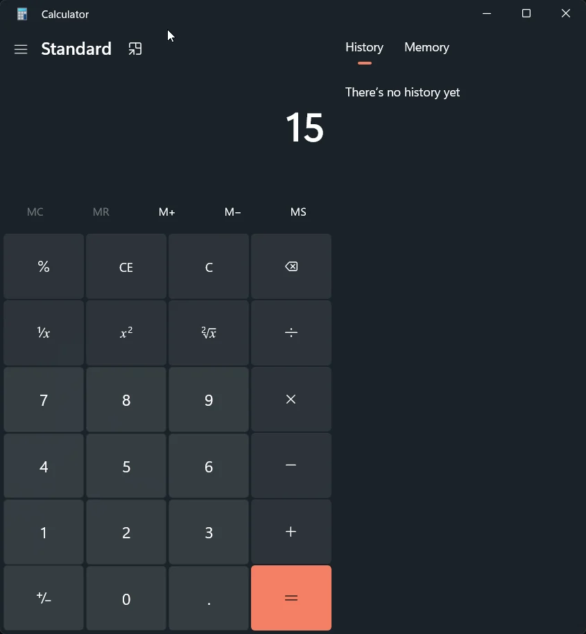
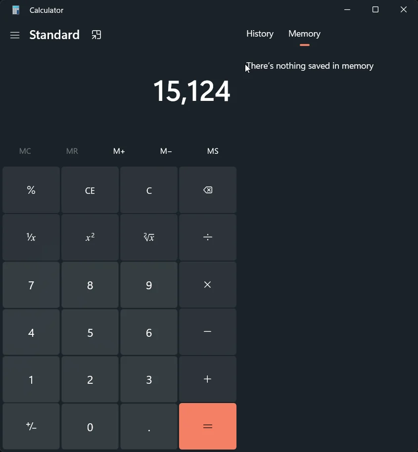
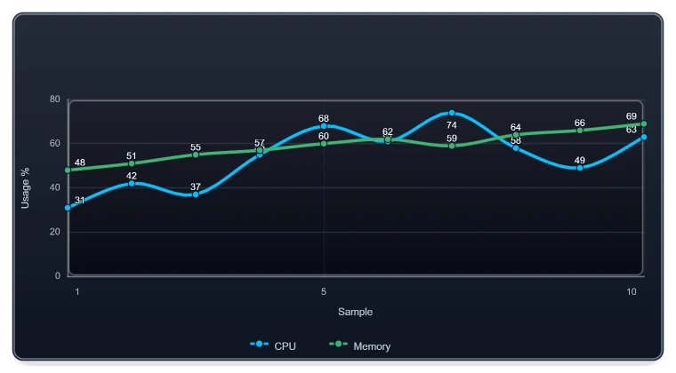

Image work is easy to dismiss as a manual task until it becomes part of a repeatable process. A support team needs QR codes generated from inventory. A publishing workflow must resize hundreds of images and remove metadata. A report needs charts, topology, and a social preview in several formats. At that point, opening an editor for every output is no longer a workflow.

[ImagePlayground](https://github.com/EvotecIT/ImagePlayground) brings those jobs into PowerShell. It is not only an image-resize command and it is not only a chart wrapper. The module covers four related areas:

- processing existing images
- creating and reading QR codes and barcodes
- inspecting and controlling image metadata
- composing charts, topology, report graphics, and visual stories

The useful part is repeatability. Inputs, transformations, dimensions, output formats, and publishing rules can live beside the rest of the automation instead of being reconstructed by hand.

## Start with the job, not the file format

The module is broad, but the entry point is usually obvious when the outcome is clear.

For an existing image, use a focused command such as `Resize-Image`, or load an image and apply several operations before saving it. That works for routine jobs such as crops, rotation, watermarks, text, mosaics, thumbnails, conversion, blur, sharpening, and visual adjustments.

```powershell
Resize-Image `
    -FilePath '.\source\company-logo.png' `
    -OutputPath '.\publish\company-logo-300.png' `
    -Width 300
```

The width-only form keeps the aspect ratio. That small detail matters when the same script runs against a folder of differently sized source images.





## Codes belong in automation too

ImagePlayground can create and read general QR content, but it also has typed commands for common payloads. Wi-Fi, contact, calendar, email, OTP, payment, location, phone, and SMS data should not require every script author to assemble an encoded payload by hand.

```powershell
New-ImageQRCodeWiFi `
    -SSID 'Contoso-Guest' `
    -Password $guestPassword `
    -FilePath '.\publish\guest-wifi.png'

$decoded = Get-ImageQRCode -FilePath '.\publish\guest-wifi.png'
```

The readback is worth keeping in a build or publishing check. It proves that the produced asset still contains the expected content after resizing or composition.


## Metadata is part of publishing

An image can contain more than its visible pixels. EXIF and related metadata may include timestamps, device information, location, authoring details, or other fields that should be reviewed before an asset leaves the organization.

ImagePlayground provides commands to inspect, export, import, update, and remove metadata. That makes sanitization a deliberate pipeline step instead of a hope that another application stripped the right fields.

A sensible publishing flow is:

1. inspect or export metadata
2. decide which fields are required
3. remove or update the remainder
4. inspect the result again
5. publish the verified output

Metadata removal should not be a blind checkbox. Some workflows need copyright or provenance fields, while others require a deliberately clean asset.

## From individual images to report visuals

The current ImagePlayground surface also reaches well beyond photo processing. PowerShell can now define charts, chart grids, visual blocks, fixed-size canvases, organization hierarchies, topology maps, and authored visual stories.

This is where ImagePlayground and [ChartForgeX](/projects/chartforgex/) overlap without becoming the same project. ChartForgeX owns the typed rendering model and deterministic SVG/PNG geometry. ImagePlayground owns the approachable PowerShell commands, parameter sets, module packaging, and script-oriented examples.

Here is a compact chart definition that can be written to PNG, SVG, or HTML by changing the output path:

```powershell
$series = @(
    New-ImageChartLine -Name 'CPU' -Value 31,42,37,55,68,61,74 -Color DeepSkyBlue -Marker Circle -Smooth
    New-ImageChartLine -Name 'Memory' -Value 48,51,55,57,60,62,59 -Color MediumSeaGreen -Marker Circle -Smooth
)

New-ImageChart `
    -Definition $series `
    -Theme Dark `
    -ShowGrid `
    -XTitle 'Sample' `
    -YTitle 'Usage %' `
    -FilePath '.\publish\resource-trend.svg' `
    -Width 760 `
    -Height 420
```



Organization and topology commands use the same idea: PowerShell data is mapped into a reusable visual model, then rendered consistently. Dense organization branches can choose compact or vertical layout policies without forcing the entire hierarchy into one arrangement. Visual canvases can combine text, charts, images, shapes, and reusable blocks into report covers, email graphics, wallpapers, or social previews.

## Static first, interaction when it helps

Static output remains the safest default for email, documents, build artifacts, and websites. SVG keeps text and geometry crisp. PNG is convenient for clients that need a fixed raster image. HTML is useful when a browser delivery surface is appropriate, and GIF or APNG can carry a portable animation when motion adds real meaning.

The important distinction is that interactivity is optional. A chart should not require a browser runtime merely to render correctly in a report.

## Where to go next

The [ImagePlayground project hub](/projects/imageplayground/) now separates the material that used to be scattered across a README and examples folder:

- [documentation](/projects/imageplayground/docs/) explains workflows and product boundaries
- [PowerShell API](/projects/imageplayground/api/) lists exported commands, parameters, and examples
- [curated examples](/projects/imageplayground/examples/) cover practical end-to-end scenarios
- [GitHub](https://github.com/EvotecIT/ImagePlayground) remains the source and issue tracker

Use ImagePlayground when the person writing the automation thinks in PowerShell and the deliverable is an image or visual asset. Use ChartForgeX directly when a .NET application owns the rendering model. The projects work together, but each keeps a clear job.
