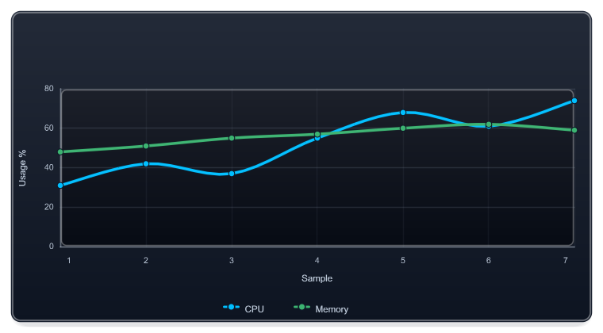

An image editor makes sense when I am working on one image. It stops making sense when a script has to resize two hundred screenshots, create a QR code for every device, remove metadata before publishing, and rebuild the same report graphic next week.

I created [ImagePlayground](https://github.com/EvotecIT/ImagePlayground) for those repeatable jobs. The module covers four areas that often meet in the same automation:

- processing existing images
- creating and reading QR codes and barcodes
- inspecting and controlling image metadata
- composing charts, topology, report graphics, and visual stories

The commands are only half of the value. The image size, crop, metadata policy, chart data, and output format remain in the script, so the next run produces the same kind of asset without relying on someone remembering the editing steps.

## Before you start

Use PowerShell 7 and install the current public modules used for this article:

```powershell
Install-Module ImagePlayground -Scope CurrentUser -Force
Import-Module ImagePlayground
```

Run the examples from a folder where you can write the generated files. Replace the sample paths and data with your own after the first successful run.

## Start with the job, not the file format

I normally start with the result I need. If the job is "make this image 1200 pixels wide," a focused command such as `Resize-Image` is enough. If several changes belong together, I load the image once, apply the operations, and save at the end. Cropping, rotation, watermarks, text, mosaics, thumbnails, conversion, blur, sharpening, and other adjustments can all take that route.

```powershell
Resize-Image `
    -FilePath '.\source\company-logo.png' `
    -OutputPath '.\publish\company-logo-300.png' `
    -Width 300
```

Because only the width is supplied, the aspect ratio is preserved. That is what I usually want when the source folder contains a mix of landscape and portrait images.

Create the output folder before running the example and use one of your own source images. For a publishing job, check the dimensions in code and look at a few representative results. A file can have the expected width and still be a poor crop.

## Codes belong in automation too

QR payloads are another place where a small manual task quickly becomes an automation problem. ImagePlayground can create and read general QR content, and it has typed commands for Wi-Fi, contacts, calendars, email, OTP, payments, locations, phone numbers, and SMS. I would rather pass a network name and password than hand-build the encoded Wi-Fi string in every script.

```powershell
$guestPassword = 'Example-Only-Change-Me'
New-ImageQRCodeWiFi `
    -SSID 'Contoso-Guest' `
    -Password $guestPassword `
    -FilePath '.\publish\guest-wifi.png'

$decoded = Get-ImageQRCode -FilePath '.\publish\guest-wifi.png'
```

The password above is fictional. The generated QR code contains the real network password in readable form, so use a guest-network credential and treat the image like the secret it contains. I also read the code back after generation and again after any resize or composition step. That catches a visually plausible image that no longer scans.


## Metadata is part of publishing

An image may carry timestamps, camera details, location, author information, and other EXIF metadata that never appears on screen. I do not want a publishing workflow to assume that another application removed it.

ImagePlayground can inspect, export, import, update, and remove metadata, which makes the decision visible in the script.

A sensible publishing flow is:

1. inspect or export metadata
2. decide which fields are required
3. remove or update the remainder
4. inspect the result again
5. publish the verified output

Removing everything is not always correct. Some assets should keep copyright or provenance fields, while others should leave the organization with a deliberately small metadata set. The second inspection proves which policy was applied.

## From individual images to report visuals

ImagePlayground also handles graphics that begin as data rather than pixels: charts, chart grids, KPI blocks, fixed-size canvases, organization hierarchies, topology maps, and longer visual stories.

The rendering work comes from [ChartForgeX](/projects/chartforgex/). ImagePlayground turns those .NET models into PowerShell commands, parameter sets, packaging, and examples. I keep that split because improvements to layout and SVG/PNG rendering should benefit .NET applications and PowerShell scripts at the same time.

Here is a compact chart definition that can be written to PNG, SVG, or HTML by changing the output path:

```powershell
$series = @(
    New-ImageChartLine -Name 'CPU' -Value 31,42,37,55,68,61,74 -Color DeepSkyBlue -Marker Circle -Smooth
    New-ImageChartLine -Name 'Memory' -Value 48,51,55,57,60,62,59 -Color MediumSeaGreen -Marker Circle -Smooth
)

New-ImageChart `
    -Definition $series `
    -Theme Dark `
    -ShowGrid `
    -XTitle 'Sample' `
    -YTitle 'Usage %' `
    -FilePath '.\publish\resource-trend.svg' `
    -Width 760 `
    -Height 420
```



Organization and topology commands follow the same pattern: map PowerShell data into a visual model, then render it. A crowded branch can use a compact layout without changing the whole organization chart. A canvas can combine text, charts, images, shapes, and reusable blocks for a report cover, email graphic, wallpaper, or social preview.

## Static first, interaction when it helps

For email, documents, and build artifacts, I start with static output. SVG keeps text and geometry sharp; PNG works almost everywhere. HTML is available when the result belongs in a browser, while GIF or APNG can carry a short animation when motion explains something useful.

Interactivity is optional. A chart included in a weekly report should render correctly without a browser runtime.

## Where to go next

The [ImagePlayground project hub](/projects/imageplayground/) brings the documentation and examples into one place:

- [documentation](/projects/imageplayground/docs/) explains workflows and product boundaries
- [PowerShell API](/projects/imageplayground/api/) lists exported commands, parameters, and examples
- [curated examples](/projects/imageplayground/examples/) cover practical end-to-end scenarios
- [GitHub](https://github.com/EvotecIT/ImagePlayground) remains the source and issue tracker

If the automation is already written in PowerShell and the output is an image or visual asset, start with ImagePlayground. If a .NET application owns the model, use ChartForgeX directly. Both paths end in the same renderer, which is exactly why I built them to work together.
