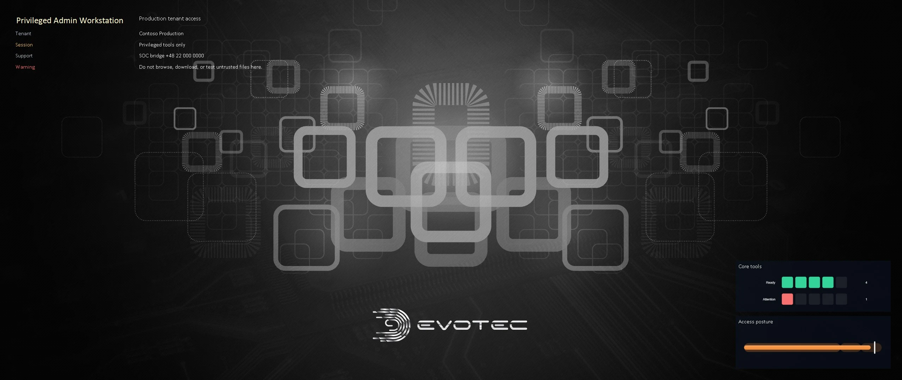
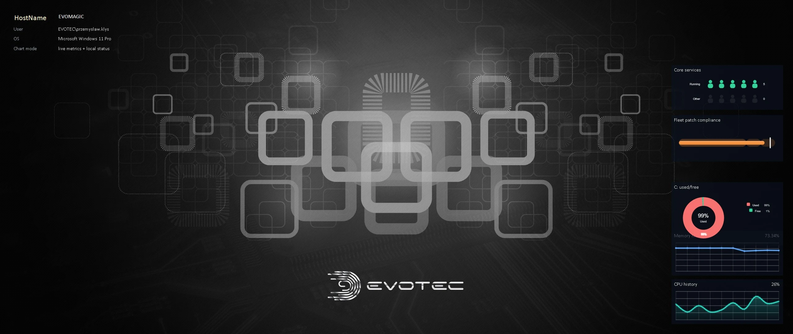
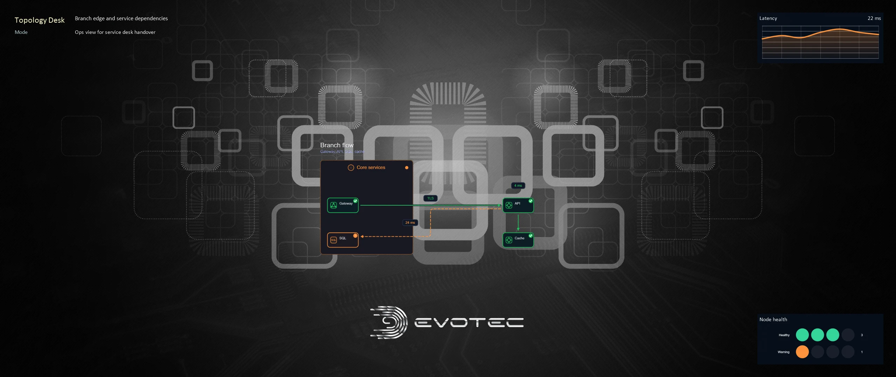

The original idea behind BGInfo is still useful: put the machine facts a technician needs directly on the desktop. The operating environment around that idea has changed. Devices have several monitors, wallpapers may rotate as slideshows, support data comes from more than the local registry, and the result often needs to be generated and deployed as policy rather than configured by hand.

[PowerBGInfo](https://github.com/EvotecIT/PowerBGInfo) is the PowerShell approach to that problem. The 2.x line is no longer just a few text values painted over one wallpaper. It can build support-ready desktop and logon backgrounds from PowerShell-authored configuration, with controlled placement, deployment targets, reusable JSON, charts, topology, and structured visual canvases.

It is useful for:

- shared admin workstations
- lab and classroom machines
- build agents and test hosts
- kiosks and training devices
- support desktops
- environments where machine identity must be visible at a glance

## Put the right facts on the screen

Built-in values cover common machine and user facts such as hostname, operating system, CPU, memory, BIOS, disks, network addresses, domain, and user identity. Custom values can come from PowerShell, CIM, the registry, Active Directory, an API, or an RMM tool.

The result is still a wallpaper, so restraint matters. A technician should be able to answer the immediate question without reading a diagnostic report on the desktop.

Good candidates include:

- which machine and user am I looking at?
- which environment or role does it belong to?
- what is the primary IP address?
- what Windows build is running?
- where should the user or technician ask for help?
- is there one operational state that requires attention?



## Author once, deploy from JSON

Long inline scripts are awkward to carry through scheduled tasks, imaging, and RMM policies. PowerBGInfo can export a reviewed configuration to JSON and execute it separately.

```powershell
$configPath = 'C:\ProgramData\PowerBGInfo\workstation.json'

New-BGInfo {
    New-BGInfoValue -BuiltinValue HostName -Name 'Machine'
    New-BGInfoValue -BuiltinValue FullUserName -Name 'User'
    New-BGInfoValue -BuiltinValue OSName -Name 'Operating system'
    New-BGInfoValue -Name 'Support' -Value 'helpdesk@contoso.com'
} -MonitorIndex 0 `
    -Target File `
    -ConfigurationDirectory 'C:\ProgramData\PowerBGInfo' `
    -JsonPath $configPath `
    -ExportOnly

Invoke-BGInfo -Path $configPath
```

This separates layout authoring from execution. The JSON can be reviewed and versioned beside the deployment policy, while the scheduled task or RMM action only needs to invoke the known configuration.

## Preview before changing a desktop

Use `-Target File` and an explicit output name while building a layout. A file preview is faster to compare, easier to attach to a review, and safer than changing the current wallpaper after every edit.

Once the result is approved, choose the narrowest deployment target:

- current user for a normal sign-in or scheduled refresh
- all existing users and the default profile for a shared device
- logon screen for system-level context
- both desktop and logon screen when the same policy belongs in each place

All-users and logon-screen changes require an elevated context. Test those paths against the Windows versions and management baselines used by the fleet.

## Multi-monitor placement and wallpaper behavior

Information that looks good on a 1920×1080 primary monitor may overlap important content on an ultrawide display or land on the wrong screen in a docked setup. PowerBGInfo supports monitor selection, corner and center anchors, offsets, and explicit placement.

It also accounts for wallpaper slideshows. A deployment can preserve the slideshow by rendering each source, or deliberately disable it for one static result. Refresh behavior matters because Windows may reuse a cached wallpaper path after sign-in; the module handles that workflow so a newly rendered file is actually shown.

## Charts should answer a small operational question

PowerBGInfo 2.x can composite ChartForgeX-backed visuals into the wallpaper. This is not an invitation to turn every desktop into a monitoring dashboard. It is useful when one compact visual answers a local question:

- CPU or memory trend on a lab host
- workspace disk usage on a build agent
- patch target on an admin workstation
- exercise progress on a training machine
- service state on a support desktop

```powershell
New-BGInfoChart `
    -Id 'cpu-history' `
    -Title 'CPU history' `
    -Metric CpuPercent `
    -Kind Area `
    -ValueSuffix '%' `
    -Width 360 `
    -Height 145 `
    -MaxPoints 60 `
    -Anchor BottomLeft `
    -OffsetX 20 `
    -OffsetY 20
```



## Topology can provide immediate context

A small topology overlay can show the services behind a lab, the route to an application, or the ownership around a shared machine. Nodes and edges come from the PowerBGInfo configuration; ChartForgeX provides the deterministic layout and rendering.



This is the same ownership boundary used elsewhere in the Evotec visual stack. [ChartForgeX](/projects/chartforgex/) owns reusable charts, topology, and visual composition. PowerBGInfo owns Windows wallpaper behavior, values, placement, deployment, caching, and refresh. [ImagePlayground](/projects/imageplayground/) exposes broader image automation through PowerShell.

## What changed since the original PowerBGInfo article

The earlier [PowerBGInfo introduction](/blog/powerbginfo-powershell-alternative-to-sysinternals-bginfo/) remains useful history, but the current product is materially broader. The modern line adds a richer value model, multi-monitor-aware placement, JSON configuration, multiple deployment targets, slideshow handling, chart and topology overlays, visual-canvas layouts, and patterns for labs, training machines, build agents, security operations, and executive summaries.

The product is still built around a simple promise: when someone looks at a managed Windows screen, the context they need should already be there.

## Documentation, API, and examples

The [PowerBGInfo project hub](/projects/powerbginfo/) now gives the project its own complete surface:

- [documentation](/projects/powerbginfo/docs/) covers deployment, refresh, layouts, and troubleshooting
- [PowerShell API](/projects/powerbginfo/api/) lists the current commands and parameter sets
- [examples](/projects/powerbginfo/examples/) link to maintained deployment, chart, topology, and visual-canvas workflows
- [GitHub](https://github.com/EvotecIT/PowerBGInfo) remains the source and issue tracker

Start with file output, test at the monitor resolutions used in the fleet, and only then apply the configuration through the intended user or system context. A desktop background is visible infrastructure; it deserves the same review discipline as any other deployed configuration.
