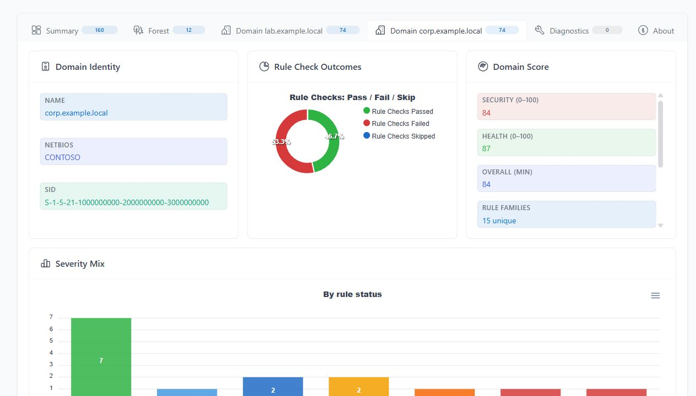
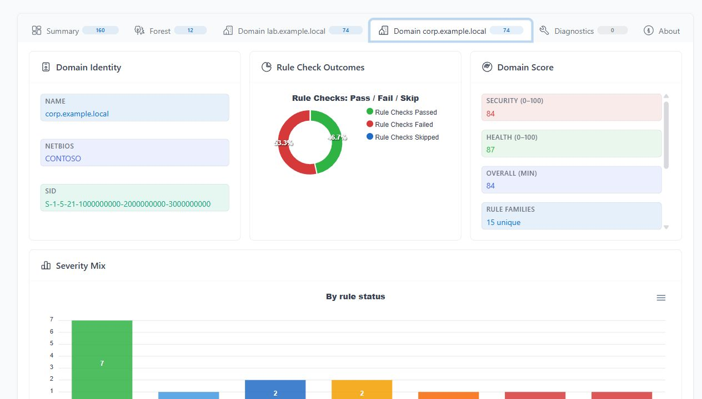
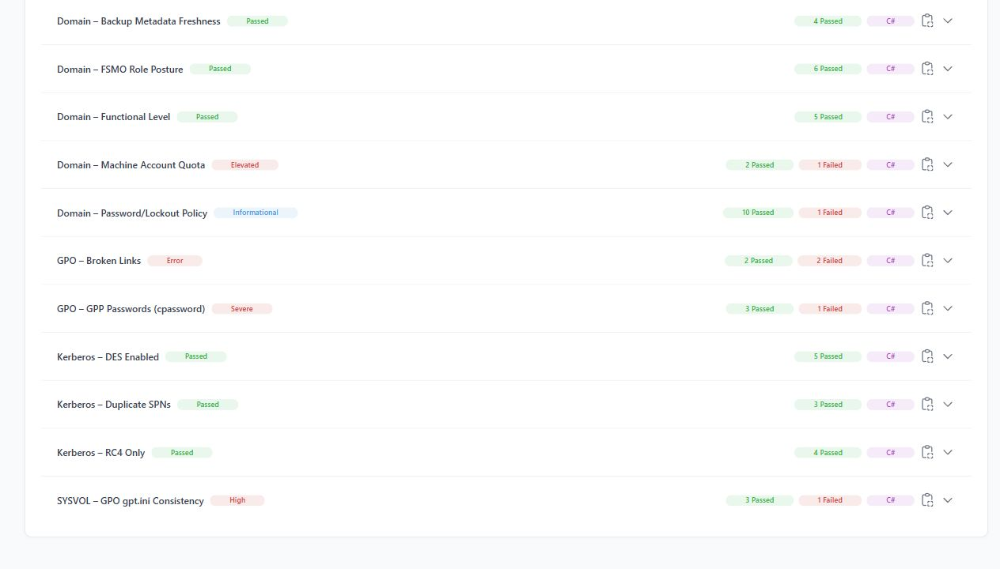
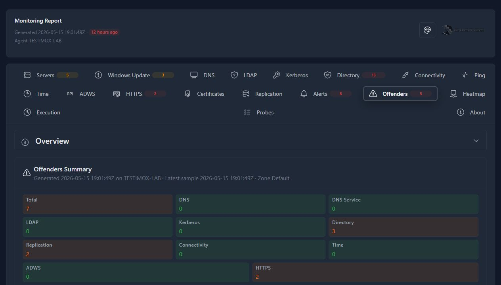
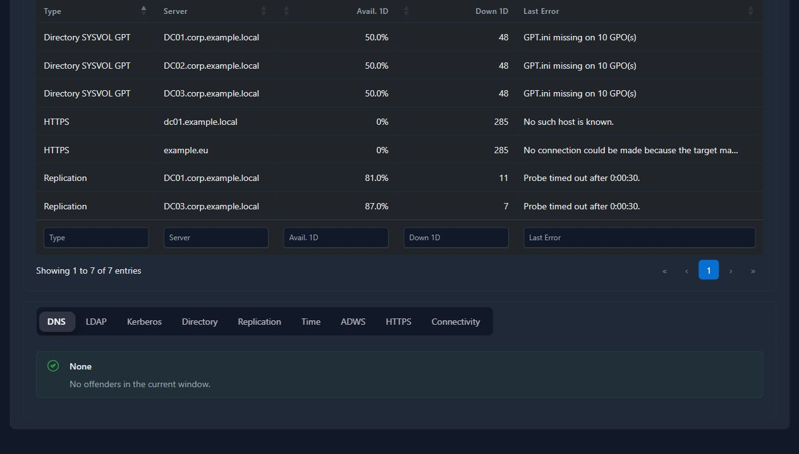

I want to ask for feedback on something that grew out of years of Active Directory work, PowerShell modules, customer audits, HTML reports, Office deliverables, and the uncomfortable gap between "run a health check once" and "know when the forest is starting to drift right now."

The short version is this:

- [GPOZaurr](https://github.com/EvotecIT/GPOZaurr) started as a practical way to understand and fix Group Policy problems.
- [ADEssentials](https://github.com/EvotecIT/ADEssentials) collected day-to-day Active Directory helper commands and reports.
- [Testimo](https://github.com/EvotecIT/Testimo) tried to make AD health checks more automated: run one command, get a report, avoid stitching together dozens of small scripts.
- TestimoX is the next version of that thinking: typed .NET engines, a Windows CLI, a PowerShell module, a service runtime, a rule catalog, multilingual reporting, HTML and Office outputs, structured exports, and continuous monitoring.

I am writing this post because it is easier to point people here than to explain the whole history in a Reddit comment, GitHub issue, email, or chat thread. It is also a better place to be transparent about the hard part: TestimoX is not simply another open-source PowerShell module. Some parts are closed source and licensed, and I want feedback on whether the product boundary, pricing shape, and community edition feel reasonable.

The screenshots below are based on real generated TestimoX output, with environment names sanitized for publishing. They are not mockups. The point is to show the kind of report surface, evidence flow, and monitoring output I am asking people to react to.

## Where This Came From

GPOZaurr and ADEssentials were built around a simple idea: administrators should not need to manually inspect every corner of AD, GPO, DNS, SYSVOL, replication, ACLs, certificates, and domain controller behavior just to understand whether something is wrong.

They helped a lot, but they also taught a few lessons.

GPOZaurr taught me how much hidden state lives in Group Policy: broken links, missing SYSVOL content, permissions, orphaned objects, WMI filters, passwords in old preference files, and reports that need to explain the problem without requiring the reader to be a GPO specialist.

ADEssentials grew from a different daily need. Sometimes you do not need a full audit; you need a reliable PowerShell command that can answer a focused AD question and return objects you can filter, export, or feed into another script. That project became a collection of practical directory checks and inventory helpers.

PowerShell is excellent for that operator surface. It is discoverable, scriptable, easy to pipe, and natural for Windows administrators. But once the logic grows, a module can become a place where too many responsibilities live together: data collection, interpretation, report shaping, remediation hints, HTML output, compatibility work, performance tuning, and edge-case handling.

Testimo took a different angle: one command should be able to run many AD tests and produce a useful report. That was the right direction, but the old shape still had limits. Some checks were slow, some report pages were heavy, and a lot of the logic was still tied too closely to PowerShell-era assumptions.

TestimoX is a rebuild of that idea around reusable engines:

- C# libraries own the collectors, models, rules, normalization, and report contracts.
- `TestimoX.exe` gives a Windows-friendly CLI, interactive run surface, automation entry point, and service-oriented runtime.
- The PowerShell module stays useful for administrators who want commands, objects, filters, scheduled scripts, and familiar Windows automation.
- Reports and exports are generated from typed evidence instead of loosely shaped script output.
- The audit tooling can turn findings into customer-facing delivery artifacts, not only console output.

That split matters. PowerShell users still get PowerShell, but the product does not depend on PowerShell being the only runtime.

## What TestimoX Adds

The core TestimoX engine is for point-in-time assessment. It asks questions such as:

- Are forest, domain, and domain controller settings aligned with expected security and operational posture?
- Are DNS, PKI, Kerberos, LDAP, replication, GPO, SYSVOL, directory hygiene, and Windows configuration checks returning healthy evidence?
- Which findings matter most, and what context explains them?
- Can the output be consumed as an HTML report, Word document, JSON file, export directory, or PowerShell object depending on the audience?

The public [TestimoX rule catalog](https://testimox.com/rules/) is meant to make that visible. It should become the place where people can browse available checks by scope, category, severity, and source type without needing to install the product first.

Every finding should go through a predictable flow:

1. Collect evidence from AD, DNS, Windows, files, certificates, baselines, or configured sources.
2. Normalize that evidence into typed models.
3. Evaluate it through a rule, profile, probe, or policy.
4. Assign status, severity, context, and remediation guidance.
5. Render it into the right surface: console, PowerShell object, HTML report, JSON export, Word report, Excel workbook, audit delivery bundle, or monitoring dashboard.

That is the goal anyway. If this flow is not clear enough, or if you think some part should be open, documented differently, or priced differently, that is exactly the feedback I am looking for.

## TestimoX.exe Is Not Just A Console Runner

One thing that is easy to miss: `TestimoX.exe` is not only a terminal wrapper around old scripts.

The CLI already has reporting switches for real output surfaces:

- HTML reports are generated by default and can be written with `--html-path`.
- Word reports can be enabled with `--word` and written with `--docx`.
- JSON output can be written with `--json`.
- Raw rule and section results can be streamed into a directory with `--export-dir`.
- Reports can be generated in selected languages with `--report-language`, for example `en` or `en,pl`.
- The report language model currently includes English, Polish, German, and Spanish.

The PowerShell module exposes the same idea from the operator side. `Invoke-TestimoX` can run profiles, publish from a durable store, write HTML reports, and request report languages. The PowerShell surface is there for people who want automation and objects; the CLI is there for people who want a single Windows executable and repeatable run commands.

The audit tooling goes further. It can create delivery-focused outputs such as:

- delivery summary as Markdown, JSON, HTML, and Word `.docx`
- remediation matrix as CSV, JSON, and Excel `.xlsx`
- delivery readiness as Markdown, JSON, and HTML
- a delivery bundle with `index.html`, `README.md`, manifest metadata, and optional zip packaging

That matters in real organizations. Some teams want JSON. Some want HTML. Some need a Word report because it becomes the audit deliverable. Some want Excel because remediation owners will filter, assign, annotate, and track work there.

The question is not "which one output is best?" The question is which outputs are worth maintaining well.

For the screenshots in this post, I generated current TestimoX output against a real AD environment to ground the story in actual artifacts:

- `TestimoX.exe` ran an 18-rule AD health/security selection covering forest discovery, backup metadata, duplicate hostnames, domain functional level, password policy, machine account quota, FSMO posture, Kerberos DES/RC4/SPN posture, computer lifecycle, LAPS coverage, account delegation, DnsAdmins membership, GPO broken links, GPP passwords, and SYSVOL GPO consistency.
- The run produced English and Polish HTML reports.
- The run produced English and Polish Word `.docx` reports.
- The run produced a JSON result file and an export directory with per-rule/per-section JSON evidence.
- The same reporting pipeline can feed audit-style deliverables, including Word summaries and Excel remediation matrices where that output makes sense.

This is what the generated assessment report looks like at the summary level:

The report is not just a single green/red score. It keeps domain context, rule groups, severity, pass/fail counts, and evidence sections visible:

And when you move down into findings, the report shows the rule families, statuses, implementation source, and expandable detail for each check:

The older public projects matter here as lineage. I am not trying to re-sell GPOZaurr, ADEssentials, or old Testimo reports. They explain how the product ended up here: PowerShell taught the workflows, Testimo taught the health-check model, and TestimoX tries to make the engine, evidence, reports, and monitoring durable enough to support properly.

## Why Monitoring Became Its Own Thing

Point-in-time assessment is useful, but it is not the same as monitoring.

An assessment can tell you that your current configuration is risky. Monitoring tells you that something started failing, slowing down, expiring, drifting, or recovering over time.

TestimoX Monitoring is the continuous side. It uses a probe-based architecture for Active Directory infrastructure checks: DNS, LDAP, Kerberos, NTP, HTTPS certificates, reachability, replication, directory health, ADWS, ping, Windows Update, and other configured probe groups.

Each monitoring run follows a lifecycle:

1. Resolve targets such as domain controllers, services, or endpoints.
2. Expand configured checks into per-target probe instances.
3. Execute probes with thresholds and timeouts.
4. Classify results as Up, Down, Degraded, Recovering, or Unknown.
5. Persist history so availability, trends, and failure patterns can be seen over time.
6. Roll results into dashboards, alerts, schedules, maintenance views, and reports.

The generated report used for the screenshots in this post is about 11 MB and was built from 68 history roots, 145 probes, and more than 73,000 historical samples. That is one environment snapshot, not a benchmark, but it shows the product shape I care about: enough history to see what happened, without requiring a separate database product just to open a useful AD-focused report.

The Monitoring report is HTML-first. Its tables can expose interactive table actions such as copy, CSV, Excel, and PDF export where enabled. That is different from the assessment and audit delivery outputs, where Word and Excel files are first-class generated artifacts.

## What The Monitoring Report Shows

The Monitoring dashboard is not meant to replace every enterprise NOC, SIEM, or metrics platform. It is meant to answer the AD-specific questions quickly:

- Which domain controllers are healthy, degraded, down, recovering, or stale?
- Which service families are affected: DNS, LDAP, Kerberos, replication, certificates, ADWS, Windows Update, ping, or connectivity?
- Is the issue local to one zone, one target, one probe group, or a broader pattern?
- Did the issue happen once, or is it visible in the recent trend?
- Are failures suppressed by maintenance windows, or should they page someone?
- Which alerts and recommendations need action first?

Here is the current Monitoring report shape from generated service output. This is the continuous side of TestimoX: probe groups, status counts, historical context, and service-family tabs in one HTML report.

Monitoring also has an offender-oriented view. This is where I want the product to be useful during a real incident or recurring failure: not only "something is wrong", but which service family is affected, which targets repeat, and what the recent error looked like.

The detailed offender table is the kind of output I personally want from AD monitoring: a short list of the worst current or recent problems, with availability, down-count, and last-error context.

Screenshots are still only part of the story. The public page should also include downloadable sanitized samples so people can judge the actual output format, not only a cropped image:

- a sample TestimoX assessment HTML report
- a sample TestimoX Word `.docx` report
- a sample JSON export or export directory
- a sample audit delivery summary `.docx`
- a sample remediation matrix `.xlsx`
- a sample Monitoring HTML report or sanitized screenshot set

Those samples should come from real generated output, sanitized where needed, so they are useful as product evidence rather than marketing decoration.

## About Licensing And Closed Source

This is the part I want to discuss openly.

The old modules are public and remain useful. GPOZaurr, ADEssentials, and Testimo helped many people, and that history matters. But TestimoX is being built as a product, not only as a weekend module.

That means some parts are closed source and licensed. The reason is not to hide the fact that AD checks exist. The reason is that maintaining a serious assessment and monitoring product takes ongoing work:

- building and validating collectors across real environments
- keeping report output readable and actionable
- reducing false positives
- maintaining CLI, PowerShell, service, HTML, JSON, Word, Excel, and monitoring surfaces
- documenting rules and APIs
- supporting customers who need predictable behavior
- funding the time required to keep improving it

The current edition model separates capabilities across community, trial, paid software, sponsor/enterprise, and delivered audit paths. The exact pricing and feature boundaries are the part I want feedback on, especially because output formats change the value of the product. HTML might be enough for a home lab or quick review. Word, Excel, JSON, delivery bundles, branding, automation, and larger monitoring target counts are usually business features.

That is the current direction, not a claim that every detail is perfect.

## What I Want Feedback On

If you work with Active Directory, I would genuinely like to know how this lands.

The product questions:

- Does the split between free, trial, paid software, sponsor/enterprise, and delivered audit services make sense?
- Would you expect pricing to be per forest, per domain, per domain controller, per monitored target, per tenant, per consultant, or something else?
- Which outputs are actually valuable to you: HTML, JSON, Word, Excel, console, PowerShell objects, delivery bundle, or monitoring report?
- Would a watermark on trial Word/Excel exports be acceptable, or would that make evaluation harder?
- Should the rule catalog be more detailed before people are asked to try the product?

The monitoring questions:

- Which AD monitoring probes would you consider mandatory?
- Do you care more about dashboard view, alerting, historical availability, or remediation guidance?
- Should TestimoX Monitoring stay lightweight and AD-specific, or should it grow toward broader infrastructure monitoring?
- How many targets should a community edition reasonably allow?
- What notification channels matter most: email, webhook, syslog, Teams, Slack, something else?

The trust questions:

- What needs to be open source for you to trust a closed-source AD assessment tool?
- Is public documentation plus a visible rule catalog enough, or do you need exported evidence schemas too?
- How much sample output should be published before you would evaluate it?
- Would you rather see a live demo, downloadable sample reports, or a guided trial?

## Useful Links

- [GPOZaurr on GitHub](https://github.com/EvotecIT/GPOZaurr)
- [ADEssentials on GitHub](https://github.com/EvotecIT/ADEssentials)
- [Testimo on GitHub](https://github.com/EvotecIT/Testimo)
- [TestimoX rule catalog](https://testimox.com/rules/)
- [TestimoX Monitoring docs](https://testimox.com/docs/monitoring/)
- [TestimoX pricing and licensing](https://testimox.com/pricing/)
- [Monitoring report demo video](https://www.youtube.com/watch?v=RAx0DBZuAec)

## Where I Am With This

I am not trying to pretend the product story is finished. TestimoX is a continuation of a long PowerShell and AD reporting journey, but it is also a shift: from open scripts toward a supported engine with public docs, visible rules, multilingual reports, Office exports, monitoring, and licensed commercial features.

That shift deserves scrutiny.

So the feedback I am looking for is practical: what would make this useful, trustworthy, and fairly priced for your environment? What should remain free? What should be paid? What should be documented better? What screenshots, sample reports, or exports would make the product easier to judge before anyone has to install it?

If the answer is "this looks useful but I need to see more," that is still useful feedback.
