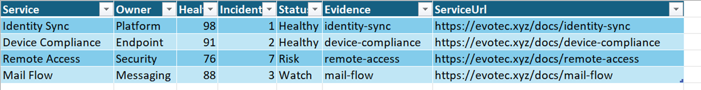

HTML tables show up everywhere: vendor portals, exported reports, internal status pages, documentation systems, monitoring dashboards, and old intranet pages that nobody wants to admit are still business critical.

The useful automation path is not to make Excel understand a whole web page. It is to extract table structure cleanly, turn it into normal data, and then write a real `.xlsx` workbook.

That is where the split between PSParseHTML, HtmlTinkerX, PSWriteOffice, and OfficeIMO makes sense:

- `HtmlTinkerX` owns the reusable .NET HTML table parsing mechanics.
- `PSParseHTML` exposes those mechanics as PowerShell commands.
- `OfficeIMO.Excel` owns the workbook engine.
- `PSWriteOffice` exposes the Excel reporting workflow for PowerShell.

In other words: parse HTML where HTML belongs, write Excel where Excel belongs.



## Why Not Put HTML Table Import Into OfficeIMO?

OfficeIMO should be good at producing and reading Office documents. It should consume common .NET data shapes like `DataTable`, `DataSet`, objects, and readers. It should not become a browser, web scraper, CSS renderer, JavaScript host, or grab bag of data-source helpers.

For HTML table ingestion, a cleaner shape is:

```text
HTML string/file/stream
  -> HtmlTinkerX / PSParseHTML
  -> DataTable or DataSet
  -> PSWriteOffice / OfficeIMO.Excel
  -> .xlsx
```

That keeps the core libraries composable. A C# application can use `HtmlTinkerX` and `OfficeIMO.Excel` directly. A PowerShell user can use `ConvertFrom-HtmlTable` and `Export-OfficeExcel`. Neither path forces HTML parsing into the Excel engine.

## Convert One HTML Table

Start with a selected table and send it straight into Excel.

```powershell
Import-Module PSParseHTML
Import-Module PSWriteOffice

$excelPath = Join-Path $PSScriptRoot 'ServiceStatus.xlsx'

ConvertFrom-HtmlTable `
    -Path .\service-status.html `
    -TableId 'services' `
    -AsDataTable `
    -IncludeLinkUrls `
    -InferTypes |
    Export-OfficeExcel `
        -Path $excelPath `
        -WorksheetName 'Services' `
        -TableName 'Services' `
        -AutoFit `
        -FreezeTopRow `
        -BoldTopRow
```

That gives you a real Excel table, not a screenshot of a table. Headers become headers, rows become rows, numeric values can become numeric values, and link URLs can be carried alongside display text when you ask for them.

## Convert All Tables

When the source HTML contains multiple useful tables, ask for a `DataSet` and export it as a workbook.

```powershell
$tables = ConvertFrom-HtmlTable `
    -Path .\service-status.html `
    -AsDataSet `
    -IncludeLinkUrls `
    -InferTypes

$tables | Export-OfficeExcel `
    -Path .\ServiceStatus.xlsx `
    -AutoFit `
    -FreezeTopRow `
    -BoldTopRow
```

This is the part that makes the design click. `ConvertFrom-HtmlTable` is responsible for HTML details such as `thead`, `tbody`, duplicate headers, empty cells, link metadata, row spans, and column spans. `Export-OfficeExcel` is responsible for turning the resulting data into workbook structure.

## Add Workbook Polish

Once the data is in Excel, you can keep using normal PSWriteOffice commands to add workbook behavior around it.

```powershell
$workbook = Get-OfficeExcel -Path $excelPath
try {
    Add-OfficeExcelTableOfContents `
        -Document $workbook `
        -SheetName 'Index' `
        -AddBackLinks

    Add-OfficeExcelChart `
        -Document $workbook `
        -WorksheetName 'Services' `
        -Range 'A1:D5' `
        -Row 8 `
        -Column 1 `
        -Type BarClustered `
        -Title 'Health and incidents'

    Save-OfficeExcel -Document $workbook
}
finally {
    Close-OfficeExcel -Document $workbook
}
```

Notice the cleanup command. Published PowerShell should not ask people to call `.Dispose()` directly when the module can provide a real `Close-*` cmdlet. The script should read like PowerShell and let the module deal with object lifetime.

## Use It In A Pipeline

Because the parser returns normal data shapes, you can inspect, filter, and enrich before creating the workbook.

```powershell
$services = ConvertFrom-HtmlTable `
    -Path .\service-status.html `
    -TableId 'services' `
    -AsDataTable `
    -IncludeLinkUrls `
    -InferTypes

$services |
    Where-Object Status -ne 'Healthy' |
    Export-OfficeExcel `
        -Path .\ServiceExceptions.xlsx `
        -WorksheetName 'Exceptions' `
        -TableName 'ServiceExceptions' `
        -AutoFit `
        -FreezeTopRow `
        -BoldTopRow
```

That is much more useful than "HTML page to Excel as seen on screen." Most reporting workflows need the data to remain data.

## Where This Should Grow

The improvements should land in the right layer:

- Better HTML table parsing belongs in `HtmlTinkerX`.
- Better PowerShell selection options belong in `PSParseHTML`.
- Better `DataTable`, `DataSet`, object, and reader ingestion belongs in `OfficeIMO.Excel`.
- Better workbook authoring, charts, formatting, and validation belongs in `PSWriteOffice`.

That split gives everyone a good path. PowerShell users get a simple pipeline. C# users get reusable libraries. OfficeIMO stays focused on Office files instead of becoming an HTML/browser/data-source framework.

The result is boring in the best way: HTML tables in, native Excel workbooks out.
